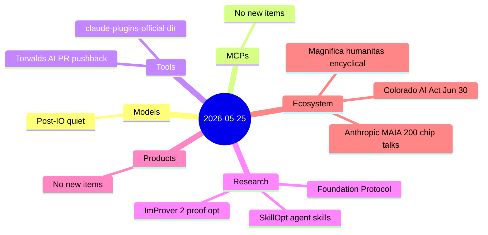
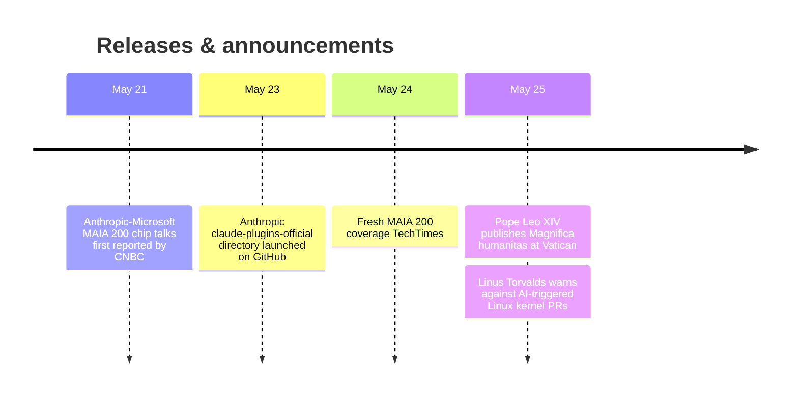

# AI Digest — 2026-05-25

> Today is lighter than average — 8 items across three active categories, with no new model or product releases. The day's defining story is Pope Leo XIV publishing "Magnifica humanitas," the first-ever papal encyclical on artificial intelligence, with Anthropic co-founder Christopher Olah speaking at the Vatican presentation — a symbolic meeting of institutional religious authority and frontier AI development focused on human dignity and labor. On the developer front, Linus Torvalds announced he will reject trivial AI-triggered Linux kernel pull requests, signaling growing friction between AI code-review automation and traditional open-source gatekeeping. Three noteworthy arXiv papers address multi-agent coordination infrastructure, Lean 4 proof optimization, and self-evolving agent skills.

## Day at a glance

## Top stories

1. **Pope Leo XIV publishes "Magnifica humanitas"** — The first papal encyclical on artificial intelligence calls for AI to serve human dignity and warns that creative industries risk being dismantled; Anthropic co-founder Christopher Olah spoke at the Vatican presentation, the first time a frontier-lab executive appeared alongside a pope at a major Church document launch. [→ details](ecosystem.md#magnifica-humanitas)

2. **Anthropic in talks with Microsoft to deploy Claude on Maia 200 chips** — Microsoft's 3 nm custom AI accelerator would become its first external customer deployment, offering Anthropic a fourth compute option (alongside SpaceX, AWS Trainium, and Google TPU) at >30 % better performance-per-dollar than current fleet hardware; no contract signed yet. [→ details](ecosystem.md#anthropic-maia-200)

3. **Foundation Protocol: coordination-layer standard for multi-agent societies** — A 29-author arXiv paper proposes graph-first infrastructure that wraps existing protocols to make multi-agent accountability and economic settlement non-negotiable at scale. [→ details](research.md#foundation-protocol)

## By the numbers

| Category   | Items | Highlight |
|------------|------:|-----------|
| Models     |     0 | Post-I/O quiet — no new releases |
| MCPs       |     0 | — |
| Tools      |     2 | Official Claude Code plugins dir; Torvalds AI-PR warning |
| Research   |     3 | Multi-agent coordination; proof optimization; self-evolving skills |
| Products   |     0 | — |
| Ecosystem  |     3 | Papal AI encyclical; MAIA 200 chip talks; Colorado AI Act |

## Timeline (UTC)

## Files
- [Models](models.md)
- [MCPs](mcps.md)
- [Tools](tools.md)
- [Research](research.md)
- [Products](products.md)
- [Ecosystem](ecosystem.md)
