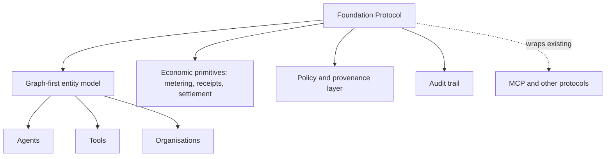

# Research — 2026-05-25

## Foundation Protocol: coordination layer for multi-agent societies 

**Source:** [arXiv 2605.23218](https://arxiv.org/abs/2605.23218) · **Type:** paper · **Time (UTC):** —

Bang Liu and 28 co-authors from multiple institutions propose the Foundation Protocol (FP), a graph-first coordination layer designed for large-scale deployments where autonomous agents interact with humans, other agents, tools, and institutional systems. FP is positioned as infrastructure that wraps existing protocols (rather than replacing them) and treats policy, provenance, and audit as foundational rather than add-ons. The design introduces economic primitives for metering, receipts, and settlement, and handles multi-party organisation and event-based collaboration. The goal is to "keep autonomous agency composable while keeping accountability non-negotiable."

**Why it matters:** As production multi-agent systems grow beyond single-vendor deployments, the absence of shared coordination infrastructure forces teams to re-implement accountability and billing at every integration boundary. FP is one of the first papers to treat the economic and governance layer — not just capability — as the core design problem; it complements the MCP protocol layer with a higher-level accountability ledger.

---

## ImProver 2: 7B model matches frontier systems on Lean 4 proof optimization 

**Source:** [arXiv 2605.22885](https://arxiv.org/abs/2605.22885) · **Type:** paper · **Time (UTC):** —

Riyaz Ahuja, Tate Rowney, Jeremy Avigad, and Sean Welleck introduce ImProver 2, a neurosymbolic framework for automatically optimising formal proofs in Lean 4 after they are written. The system uses an expert-iteration pipeline with a scaffold that exposes formal proof structure with informal abstractions, custom metrics for measuring structural proof properties, and a 7B-parameter model fine-tuned on the resulting data. The 7B model significantly outperforms larger models in its family on proof restructuring, demonstrating that proof optimisation is a scalable, learnable task in which scaffolding enables small models to match frontier-scale systems.

**Why it matters:** Proof optimisation — shortening, restructuring, or making proofs more readable — is a meaningful bottleneck in formal verification workflows. ImProver 2 showing that a 7B model can match much larger models with the right scaffolding is relevant both to teams building Lean-based verification pipelines and to the broader question of whether structured symbolic scaffolds can substitute for raw parameter scale.

---

## SkillOpt: systematic text-space optimizer for self-evolving agent skills 

**Source:** [arXiv 2605.23904](https://arxiv.org/abs/2605.23904) · **Type:** paper · **Time (UTC):** —

Yifan Yang and 14 collaborators at multiple institutions treat agent skills (natural-language documents describing how an agent should behave in a domain) as trainable external parameters while keeping the base model frozen. A separate optimizer model converts scored rollouts into bounded add/delete/replace edits on skill documents, accepting only edits that improve validation performance. The system incorporates textual learning rates and rejected-edit buffers analogous to gradient descent mechanics; it adds zero inference-time overhead at deployment. The approach achieves +23.5 point accuracy improvements with GPT-5.5 and transfers across model scales without reoptimisation.

**Why it matters:** Most current agent skill engineering is either hand-written (expensive) or a single-shot LLM generation pass (brittle). SkillOpt introduces a principled optimization loop that converges to better skill documents without touching model weights, which is directly applicable to teams building domain-specialist agents that need to improve over time in production.

---
