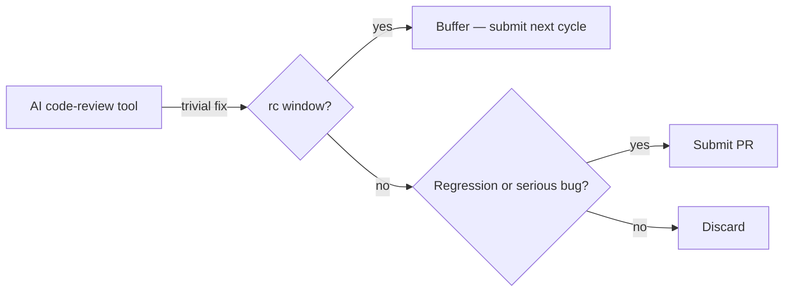

# Tools — 2026-05-25

## Anthropic launches official Claude Code plugins directory 

**Source:** [GitHub — anthropics/claude-plugins-official](https://github.com/anthropics/claude-plugins-official) · [AIToolly coverage](https://aitoolly.com/ai-news/article/2026-05-23-anthropic-launches-official-claude-code-plugins-directory-to-standardize-high-quality-ai-extensions) · **Type:** release · **Time (UTC):** May 23

Anthropic published `claude-plugins-official`, an Anthropic-curated GitHub repository serving as the canonical index of high-quality extensions for Claude Code. A companion repo, `knowledge-work-plugins`, ships 11 open-source plugins targeted at knowledge workers inside Claude Cowork (CRM, legal, analytics, and productivity profiles), while `claude-plugins-community` is a read-only mirror of the community marketplace with submission routing to a central portal. All three repos are hosted under the `anthropics` GitHub org.

**Why it matters:** Centralising plugin curation under Anthropic's org gives enterprises a verified baseline for extension vetting and gives plugin authors a clear quality target, similar to how VS Code's Marketplace featured list functions. The companion `knowledge-work-plugins` repo also signals that Claude Cowork is being positioned as a customisable professional tool alongside Claude Code.

---

## Linus Torvalds: stricter policy on AI-triggered Linux kernel pull requests 

**Source:** [The Register, 2026-05-25](https://www.theregister.com/oses/2026/05/25/linus-torvalds-to-start-being-more-hardnosed-about-pointless-pull-requests-some-of-which-come-from-ais/5245549) · **Type:** policy update · **Time (UTC):** May 25

Torvalds flagged in the Linux 7.1 rc5 announcement that the release was "significantly larger than historical precedent," tracing the excess to pull requests triggered by AI code-review tools proposing trivial fixes at an inappropriate point in the stabilisation cycle. He stated he will "be pushing back on pointless pull requests" and that contributors must evaluate whether a fix addresses an actual regression or serious issue before submitting in an rc window. Torvalds noted: "several of these series were triggered by AI code review" and that "large rc weeks are not conducive to long-term stability."

**Why it matters:** AI-assisted review tools (both IDE plugins and autonomous agents) are now generating enough kernel-level noise to prompt explicit policy intervention from the project's lead. Engineers shipping AI code-review into CI/CD pipelines targeting upstream open-source projects should gate automated submissions behind a regression-or-serious-bug filter rather than letting all low-severity suggestions surface as PRs.

---
