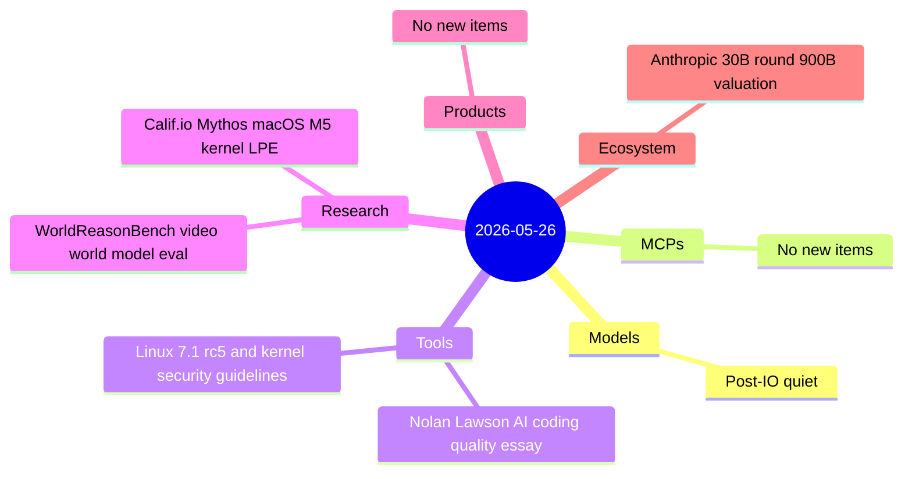

# AI Digest — 2026-05-26

> Today is a light day — 5 items across three active categories — as the post–Google I/O period remains quiet for model and product releases. The defining story is Anthropic closing its second $30B funding round of the year at a $900B+ pre-money valuation, co-led by Sequoia, Dragoneer, Altimeter, and Greenoaks, vaulting past OpenAI to become the world's most valuable AI startup. In security research, Calif.io and Anthropic Research disclosed the first public macOS kernel local privilege escalation chain targeting Apple M5 hardware with Memory Integrity Enforcement — developed in five days using Mythos Preview and patched in macOS Tahoe 26.5. Developer discourse was dominated by Nolan Lawson's viral essay arguing that AI tools are best used to write better code more slowly, not to maximize output.

## Day at a glance



## Top stories

1. **Anthropic closes second $30B round at $900B+ valuation** — Co-led by Sequoia, Dragoneer, Altimeter, and Greenoaks (~$2B each), the round makes Anthropic the most valuable AI startup in the world, ahead of OpenAI's $852B; IPO targeted for October 2026. [→ details](ecosystem.md#anthropic-30b-round)
2. **Calif.io + Mythos: first public macOS M5 kernel exploit developed in 5 days** — A three-person team with Mythos Preview built a full data-only kernel LPE chain on macOS with Memory Integrity Enforcement enabled; kernel integer overflow CVE-2026-28952 patched in macOS Tahoe 26.5. [→ details](research.md#califio-macos-kernel-lpe)
3. **"Using AI to write better code more slowly"** — Nolan Lawson's HN #1 essay advocates deploying multiple AI models (Claude, Codex, Cursor Bugbot) as independent reviewers; cross-model consensus sharply cuts false positives. [→ details](tools.md#ai-code-quality-essay)

## By the numbers

| Category   | Items | Highlight                                                   |
|------------|------:|-------------------------------------------------------------|
| Models     |     0 | Post-I/O lull — no new releases                            |
| MCPs       |     0 | —                                                           |
| Tools      |     2 | AI-as-reviewer essay; Linux 7.1 rc5 + security doc         |
| Research   |     2 | Mythos macOS M5 LPE; WorldReasonBench video eval           |
| Products   |     0 | —                                                           |
| Ecosystem  |     1 | Anthropic $30B at $900B+, surpasses OpenAI in valuation     |

## Timeline (UTC)

```mermaid
timeline
  title Releases & announcements
  section May 25
    19:00 : Nolan Lawson essay published
    20:00 : Linus Torvalds releases Linux 7.1 rc5
  section May 26
    00:00 : Calif.io macOS M5 LPE disclosure goes live
    14:00 : Anthropic $30B round expected to close this week
```

## Files
- [Models](models.md)
- [MCPs](mcps.md)
- [Tools](tools.md)
- [Research](research.md)
- [Products](products.md)
- [Ecosystem](ecosystem.md)
