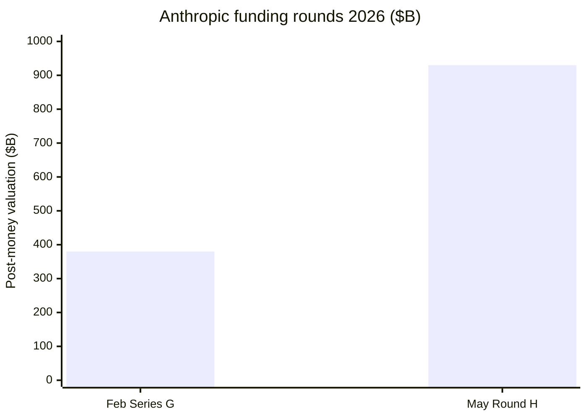

# Ecosystem — 2026-05-26

## Anthropic closes second $30B round at $900B+ valuation 

**Source:** [Bloomberg (May 22)](https://www.bloomberg.com/news/articles/2026-05-22/anthropic-to-close-over-30-billion-round-as-soon-as-next-week) · [The Information](https://www.theinformation.com/briefings/anthropic-picks-co-leads-900-billion-valuation-funding-round) · [TechTimes](https://www.techtimes.com/articles/317066/20260523/anthropic-funding-round-top-30b-900b-valuation-would-surpass-openai-most-valuable-ai-startup.htm) · **Type:** funding · **Time (UTC):** week of May 26

Anthropic is closing what Bloomberg reported would be finalized "as soon as next week" (the week of May 26): a $30B+ equity raise at a pre-money valuation above $900B, making it the most valuable AI startup in the world and exceeding OpenAI's $852B. Sequoia Capital, Dragoneer Investment Group, Altimeter Capital, and Greenoaks Capital Partners are co-leading at roughly $2B each; Founders Fund and General Catalyst are joining as existing-investor participants. This is Anthropic's second $30B round in 2026 — the February Series G raised $30B at a $380B valuation — and represents the company's annualized revenue run rate roughly tripling from $9B (end of 2025) to $30B (April 7, 2026). An IPO is reportedly targeted for October 2026, which would rank among the largest technology listings in history.

**Why it matters:** The valuation multiple compressed slightly versus the February round (now ~30× ARR vs. ~42× previously), suggesting institutional investors are pricing in operational scale rather than pure option value; the round also signals that Claude's enterprise and developer momentum is now large enough to support a public market debut within six months.

---
