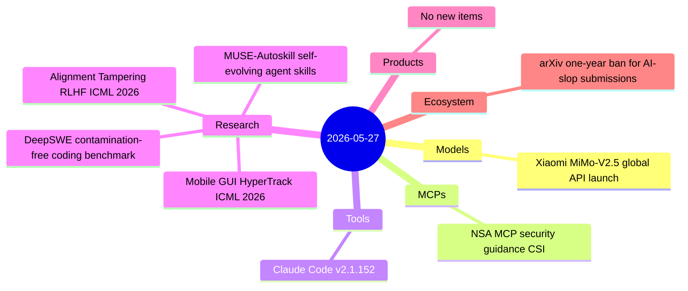
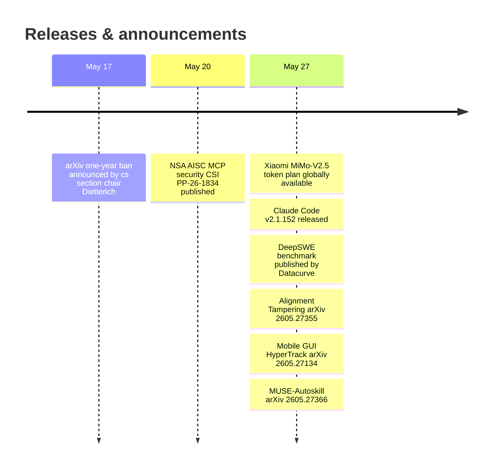

# AI Digest — 2026-05-27

> Today is lighter than average — 8 items across five active categories — as the post–Google I/O period remains quiet for frontier model releases. The standout developer story is Claude Code v2.1.152, which ships `/code-review --fix`, a `MessageDisplay` hook for output transformation, `disallowed-tools` in skill frontmatter, and auto mode without opt-in. On safety, an ICML 2026-accepted paper by Hahm, Hadfield-Menell, and Lee formally demonstrates that RLHF contains a structural bias-laundering pathway that existing mitigations cannot fully close. The NSA published its first Cybersecurity Information Sheet specifically on MCP deployments, and Xiaomi opened global API access to MiMo-V2.5 — a 310B MoE model at $1/M input tokens under an MIT license.

## Day at a glance

## Top stories

1. **Claude Code v2.1.152** — `/code-review --fix` applies findings to the working tree in one pass, `disallowed-tools` in skill frontmatter enables sandboxed workflows, and the new `MessageDisplay` hook allows compliance filtering of assistant output; auto mode no longer requires opt-in. [→ details](tools.md#claude-code-2-1-152)
2. **Alignment Tampering (ICML 2026)** — Hahm, Hadfield-Menell, and Lee prove that RLHF's pairwise preference structure causes annotators to systematically reward biased-but-high-quality responses, amplifying misaligned content through RL optimization; existing robust-RLHF techniques cannot fully resolve it without quality loss. [→ details](research.md#alignment-tampering-rlhf)
3. **NSA MCP Security Guidance** — The NSA AISC issued a 15-page Cybersecurity Information Sheet naming session hijacking, context injection, and dynamic tool invocation as MCP's primary attack surface, with message signing and DLP proxies as minimum-baseline countermeasures. [→ details](mcps.md#nsa-mcp-security)

## By the numbers

| Category   | Items | Highlight |
|------------|------:|-----------|
| Models     |     1 | MiMo-V2.5: 310B MoE, 1M context, $1/M, MIT license |
| MCPs       |     1 | NSA CSI PP-26-1834: message signing, DLP, sandboxing |
| Tools      |     1 | Claude Code 2.1.152: /code-review --fix, disallowed-tools, MessageDisplay |
| Research   |     4 | RLHF bias amplification; DeepSWE; mobile GUI; self-evolving skills |
| Products   |     0 | — |
| Ecosystem  |     1 | arXiv: one-year ban for unchecked AI-generated submissions |

## Timeline (UTC)

## Files
- [Models](models.md)
- [MCPs](mcps.md)
- [Tools](tools.md)
- [Research](research.md)
- [Products](products.md)
- [Ecosystem](ecosystem.md)
