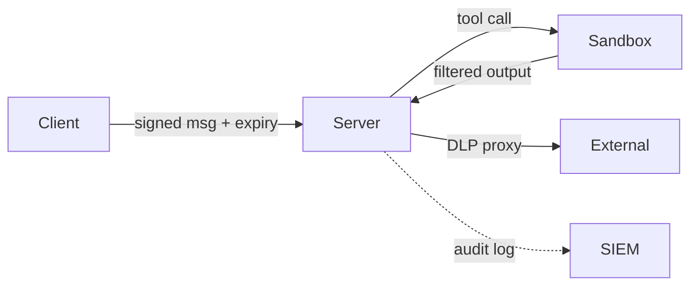

# MCPs — 2026-05-27

## NSA Publishes First MCP Security Design Guidance 

**Source:** [NSA Press Release](https://www.nsa.gov/Press-Room/Press-Releases-Statements/Press-Release-View/Article/4496698/nsa-releases-security-design-considerations-for-ai-driven-automation-leveraging/) · [CSI PDF](https://www.nsa.gov/Portals/75/documents/Cybersecurity/CSI_MCP_SECURITY.pdf) · **Type:** guidance · **Time (UTC):** — (published May 20)

The NSA's Artificial Intelligence Security Center (AISC) released Cybersecurity Information Sheet PP-26-1834, "Model Context Protocol (MCP): Security Design Considerations for AI-Driven Automation," on May 20 — the first U.S. government guidance document specifically targeting MCP deployments. The 15-page document identifies six primary risk categories: serialization vulnerabilities, poorly defined trust boundaries, agent misuse via dynamic tool invocation, implicit trust relationships, context sharing, and session hijacking. The NSA's minimum-baseline recommendations include signing MCP messages with expiration timestamps and replay-protection tokens, deploying filtering egress proxies with data-loss-prevention rules, sandboxing tool execution, and auditing outbound context before it leaves the server boundary.

**Why it matters:** NSA naming MCP by name in a formal CSI signals the protocol is present in national-security-adjacent production environments. The document gives enterprise security teams a concrete checklist and hints at specific attack patterns — particularly session hijacking and context injection — that the NSA has observed in the wild.

---
