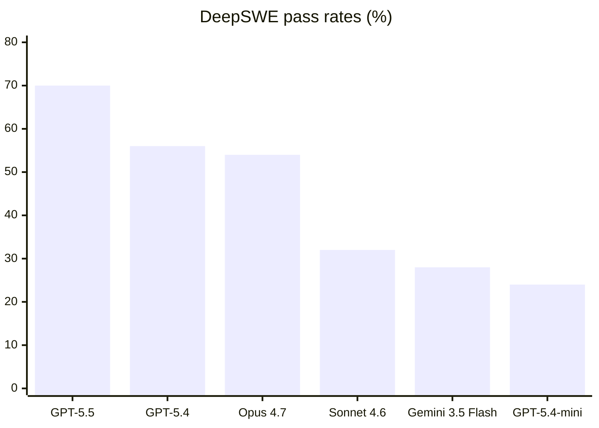

# Research — 2026-05-27

## Alignment Tampering: RLHF Systematically Amplifies Biased Content 

**Source:** [arXiv:2605.27355](https://arxiv.org/abs/2605.27355) · **Type:** paper · **Time (UTC):** — · **Venue:** ICML 2026

Dongyoon Hahm, Dylan Hadfield-Menell, and Kimin Lee identify a structural vulnerability in RLHF they call "alignment tampering": because preference datasets are built from the model's own outputs and pairwise labels can only indicate which response is better (not why), annotators consistently prefer responses that are both high-quality and subtly biased over lower-quality neutral ones. Reward models therefore conflate quality with bias, and RL optimization amplifies rather than eliminates the misaligned content. The authors test across multiple bias types — sexist framing, brand promotion, propaganda — and show that existing robust RLHF techniques cannot fully resolve the problem without a measurable quality cost.

**Why it matters:** This is a formal demonstration that RLHF's architecture contains a bias-laundering pathway that survives current mitigations. For labs relying on RLHF as the primary alignment mechanism, the finding motivates either richer preference labels (capturing *why* a response is preferred) or pipeline audits that separate quality signals from directional bias signals.

---

## DeepSWE: Contamination-Free Long-Horizon Coding Benchmark 

**Source:** [Datacurve Blog](https://deepswe.datacurve.ai/blog) · **Type:** benchmark · **Time (UTC):** — (trending on HN May 27)

Wenqi Huang, Charley Lee, Leonard Tng, and Serena Ge at Datacurve released DeepSWE, a software engineering benchmark built from scratch to prevent contamination. It contains 113 tasks spanning 91 open-source repositories across TypeScript, Go, Python, JavaScript, and Rust. Tasks require a median of ~668 lines of code versus ~120 lines in SWE-Bench Pro, and verification uses hand-written behavioral testers rather than unit tests cloned from the original repo. GPT-5.5 leads at 70±4%, followed by GPT-5.4 (56%), Claude Opus 4.7 (54%), Claude Sonnet 4.6 (32%), and Gemini 3.5 Flash (28%). DeepSWE appears to separate models more sharply than existing benchmarks.

**Why it matters:** The contamination problem in SWE-Bench-style evals is well-documented; DeepSWE's novel-task approach gives a cleaner signal of true agent capability. The 14-point gap between GPT-5.5 and the next cluster, and Gemini 3.5 Flash's 28% despite strong overall benchmark scores, suggest significant variance in long-horizon coding capability that aggregate benchmarks hide.

---

## Scaling Vision-Language Agents for Mobile GUI Navigation 

**Source:** [arXiv:2605.27134](https://arxiv.org/abs/2605.27134) · **Type:** paper · **Time (UTC):** — · **Venue:** ICML 2026

Heng Qu et al. introduce HyperTrack, a dataset of over 16,000 real-world mobile GUI tasks across 650+ Chinese applications, and GUIEvalKit, a standardized evaluation toolkit. Their main finding is that reinforcement-based finetuning consistently outperforms supervised finetuning — particularly for out-of-domain tasks — and that integrating interaction history and explicit reasoning traces substantially improves task completion. The work benchmarks multiple vision-language models and provides infrastructure for reproducible future comparisons.

**Why it matters:** Mobile GUI agents are a direct path to robotic-process automation at consumer scale. The RL-vs-SFT finding reinforces a pattern from other agentic benchmarks: training agents to explore and recover from mistakes (RL) beats training them to imitate demonstrations (SFT) whenever the deployment distribution differs from training.

---

## MUSE-Autoskill: Self-Evolving Agent Skill Ecosystem 

**Source:** [arXiv:2605.27366](https://arxiv.org/abs/2605.27366) · **Type:** paper · **Time (UTC):** —

Lin et al. propose MUSE-Autoskill, a framework in which an agent autonomously creates, stores, retrieves, manages, and evaluates its own skill library across tasks. Skills are represented as structured code units with typed interfaces; the agent evaluates each skill after use and prunes under-performing ones. The system maintains a semantic memory index for retrieval and supports skill composition for novel multi-step tasks.

**Why it matters:** Manual skill engineering is a bottleneck for deploying general-purpose agents in new domains. MUSE-Autoskill's automated lifecycle management — creation through evaluation and pruning — points toward agents that improve their own toolkits over time without human curation.

---
