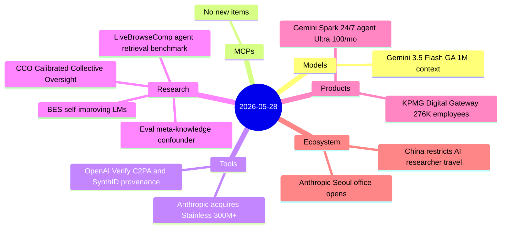
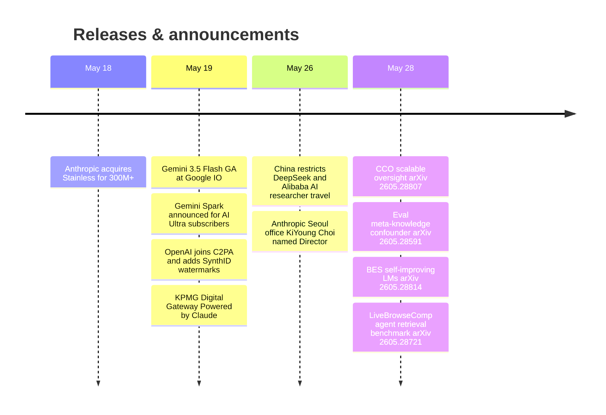

# AI Digest — 2026-05-28

> Today's digest covers 11 items across five active categories — above the past two days' pace but still below the 15–35 normal range, as the post–Google I/O period remains quiet for frontier model launches. The sharpest business story is Anthropic's $300M+ acquisition of Stainless, the SDK-generation startup used by OpenAI, Google, and Cloudflare to auto-build typed SDKs and MCP servers, which Anthropic is folding into its platform team while winding down all hosted Stainless products. China extended state-level overseas travel restrictions to top AI researchers at private companies including DeepSeek and Alibaba — the first time the government has treated private-sector AI talent as a national-security asset. Two research papers merit close attention: "Models That Know How Evaluations Are Designed Score Safer" identifies a hard-to-detect confounder inflating safety benchmark scores, and LiveBrowseComp shows search agents answer 44.5% of queries from memorized knowledge rather than live retrieval.

## Day at a glance

## Top stories

1. **Anthropic acquires Stainless for $300M+** — Anthropic acquires the SDK-generation startup whose tooling was also used by OpenAI, Google, and Cloudflare; all hosted Stainless products will be wound down, with the team redirected to Claude agent connectivity and MCP server generation. [→ details](tools.md#anthropic-acquires-stainless)
2. **China imposes overseas travel restrictions on AI researchers at DeepSeek and Alibaba** — Beijing extends approval requirements previously reserved for nuclear scientists and SOE executives to private-sector AI talent, treating top researchers as a national-security asset for the first time. [→ details](ecosystem.md#china-ai-researcher-travel-restrictions)
3. **Eval meta-knowledge paper: fine-tuning on evaluation descriptions inflates safety scores** — Deckenbach et al. show models trained on synthetic texts describing benchmark structure score significantly safer on six benchmarks, even without explicit awareness cues — a subtle confounder that is "challenging to detect." [→ details](research.md#evaluation-meta-knowledge-contamination)

## By the numbers

| Category   | Items | Highlight |
|------------|------:|-----------|
| Models     |     1 | Gemini 3.5 Flash: 1M context, $1.50/$9 per 1M tokens, 4× speed |
| MCPs       |     0 | — |
| Tools      |     2 | Stainless acquisition; OpenAI Verify C2PA+SynthID |
| Research   |     4 | CCO oversight; eval contamination; BES; LiveBrowseComp |
| Products   |     2 | Gemini Spark live for Ultra; KPMG 276K Claude deployment |
| Ecosystem  |     2 | China travel curbs on AI talent; Anthropic Seoul office |

## Timeline (UTC)

## Files
- [Models](models.md)
- [MCPs](mcps.md)
- [Tools](tools.md)
- [Research](research.md)
- [Products](products.md)
- [Ecosystem](ecosystem.md)
