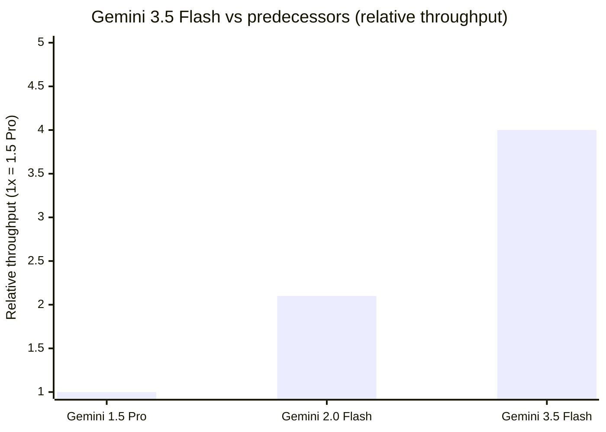

# Models — 2026-05-28

## Gemini 3.5 Flash 

**Source:** [Google / CNBC](https://www.cnbc.com/2026/05/19/google-ai-ultra-gemini-spark-omni.html) · [Google Developers Blog](https://developers.googleblog.com/all-the-news-from-the-google-io-2026-developer-keynote/) · **Type:** release · **Time (UTC):** May 19 (Google I/O keynote)

Google released Gemini 3.5 Flash as a generally available model at its I/O 2026 developer conference. The model supports a 1 million token context window and is positioned as the fast, low-cost inference backbone for both the Gemini API and the Antigravity agent orchestration framework. Pricing is $1.50 per million input tokens and $9 per million output tokens. Google describes throughput as approximately 4× that of Gemini 1.5 Pro at comparable quality levels.

**Why it matters:** Gemini 3.5 Flash is the inference engine for Gemini Spark (Google's 24/7 agentic assistant) and the target model for Google AI Ultra's $100/month subscription tier; its GA status unlocks the complete agentic stack for third-party developers building on Google Cloud.

| Spec | Value |
|------|-------|
| Context window | 1M tokens |
| Relative speed | ~4× Gemini 1.5 Pro |
| Input price | $1.50 / 1M tokens |
| Output price | $9.00 / 1M tokens |
| Availability | GA via Google AI Studio and API |

---
