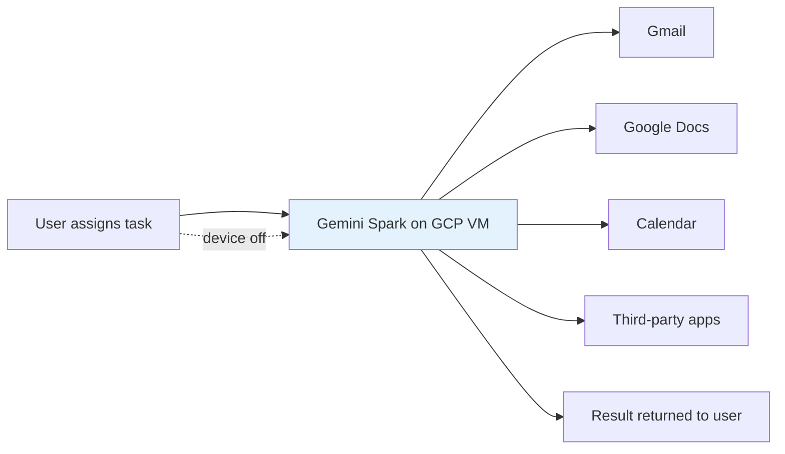

# Products — 2026-05-28

## Gemini Spark launches for Google AI Ultra subscribers 

**Source:** [TechCrunch](https://techcrunch.com/2026/05/19/google-introduces-gemini-spark-a-24-7-agentic-assistant-with-gmail-integration/) · [TechTimes](https://www.techtimes.com/articles/317144/20260525/gemini-spark-googles-24-7-cloud-ai-agent-now-executes-tasks-third-party-apps.htm) · [CNBC](https://www.cnbc.com/2026/05/19/google-ai-ultra-gemini-spark-omni.html) · **Type:** launch · **Time (UTC):** May 25 (beta rollout to Ultra subscribers)

Google Gemini Spark is a 24/7 autonomous AI agent that runs on Google Cloud virtual machines and continues executing tasks when the user's device is powered off — a meaningful architectural distinction from session-based assistants. Announced at Google I/O on May 19, Spark entered trusted-tester mode immediately and began rolling out to all Google AI Ultra subscribers ($100/month, repriced from $250 at I/O) by May 25. Spark is powered by Gemini 3.5 Flash and orchestrated by Google's internal **Antigravity** agent framework. Integration covers Gmail, Google Docs, Calendar, Chrome, and select third-party apps. Google requires explicit user permission before Spark takes "high-stakes actions" such as making purchases or sending external emails.

**Why it matters:** This is the first always-on autonomous agent embedded in a major consumer AI subscription below $150/month; it sets a product baseline that OpenAI (with ChatGPT tasks) and Anthropic will face competitive pressure to match among users who want persistent delegation rather than interactive conversation.

---

## KPMG Digital Gateway Powered by Claude 

**Source:** [Anthropic](https://www.anthropic.com/news/anthropic-kpmg) · [KPMG](https://kpmg.com/xx/en/media/press-releases/2026/05/kpmg-and-anthropic-sign-global-alliance-and-launch-digital-gateway-powered-by-claude.html) · **Type:** launch · **Time (UTC):** May 19

KPMG and Anthropic announced **KPMG Digital Gateway Powered by Claude**, embedding Claude directly into KPMG's client delivery platform. All 276,000+ employees across 138 countries gain access to the full Claude suite. Initial focus areas are Tax & Legal (where KPMG reports that building a regulatory-compliance agent previously requiring weeks now takes minutes) and private equity, with full deployment on Microsoft Azure targeted for September 2026. Separately, KPMG will co-develop new Claude-powered products for PE portfolio companies under the **KPMG Blaze** brand, which embeds Claude Code into IT modernization workflows. Anthropic is formally naming KPMG as its preferred PE advisory partner.

**Why it matters:** KPMG is the largest single Claude deployment by workforce headcount announced to date; the co-development structure and named preferred-partner status reflects the alliance model Anthropic is pursuing to compete with OpenAI's $4B DeployCo consulting subsidiary, which uses forward-deployed engineers and a different partnership structure.

---
