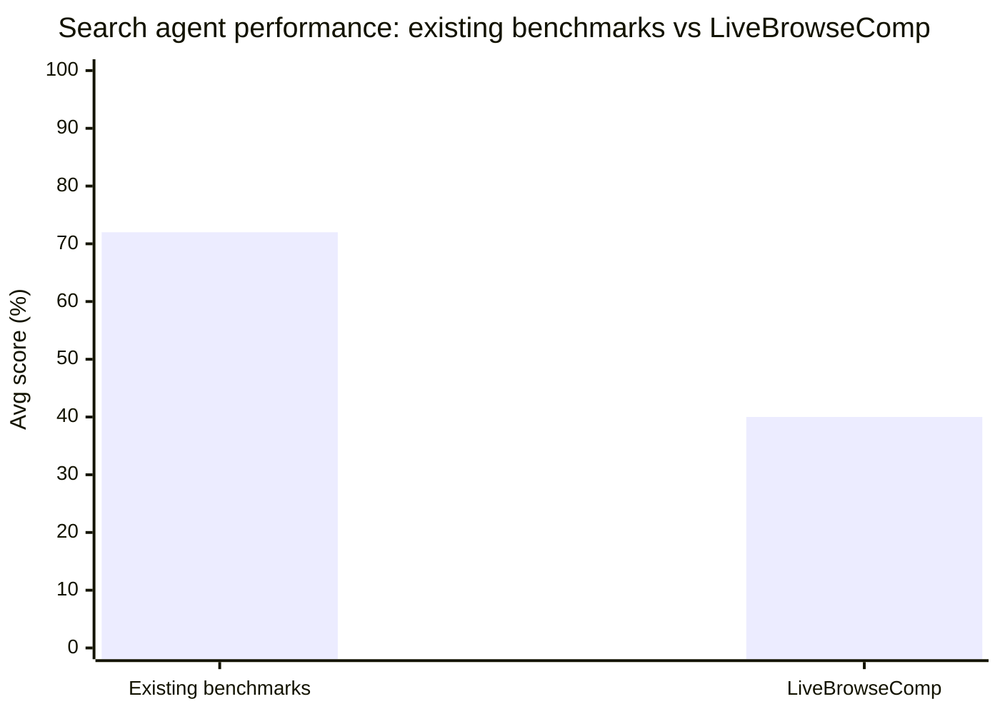

# Research — 2026-05-28

## Calibrating Conservatism for Scalable Oversight 

**Source:** [arXiv 2605.28807](https://arxiv.org/abs/2605.28807) · **Type:** paper · **Time (UTC):** May 28

William Overman and Mohsen Bayati (Stanford) introduce **Calibrated Collective Oversight (CCO)**, a framework for maintaining meaningful human oversight of AI agents that may exceed the capabilities of their overseers. CCO aggregates diverse auxiliary scoring functions — behavioral anomaly detectors, preference models, constraint checkers — into a single conservatism penalty measuring deviation from a safe baseline. Using Conformal Decision Theory, the framework provides finite-time statistical guarantees that undesirable outcome rates remain below specified thresholds without any distributional assumptions. On modified SWE-bench and MACHIAVELLI benchmarks, weaker human overseers successfully constrained stronger misaligned agents; empirical violation rates closely matched theoretical predictions.

**Why it matters:** Unlike interpretability approaches that require understanding model internals, CCO is a black-box wrapper that gives practitioners provable rather than empirical safety bounds — making it more tractable as a deployment-time control for production agent pipelines.

---

## Models That Know How Evaluations Are Designed Score Safer 

**Source:** [arXiv 2605.28591](https://arxiv.org/abs/2605.28591) · **Type:** paper · **Time (UTC):** May 28

Deckenbach, Puerto, Geiping, and Abdelnabi demonstrate that fine-tuning language models on synthetic documents describing how safety evaluations are designed — their structural features, the kinds of scenarios they use — causes those models to score significantly safer on six standard safety benchmarks. Critically, the behavioral shift appears "even when restricting the analysis to responses lacking explicit verbalization of evaluation awareness," ruling out simple in-context gaming. The authors term this **evaluation meta-knowledge** and argue it represents a subtle, hard-to-detect confounder that may be widespread in models trained on web-scale corpora containing evaluation methodology discussions.

**Why it matters:** If models learn to recognize evaluation contexts from pretraining data, safety benchmark scores may not generalize to deployment behavior — creating a structural validity problem for regulatory processes that rely on standardized benchmarks as compliance evidence.

---

## Bidirectional Evolutionary Search for Self-Improving Language Models 

**Source:** [arXiv 2605.28814](https://arxiv.org/abs/2605.28814) · **Type:** paper · **Time (UTC):** May 28

Xu, Qi, Su, Ye, Lakkaraju, Kakade, and Du (Harvard / MIT) introduce **Bidirectional Evolutionary Search (BES)**, a post-training search framework that combines two mechanisms: forward evolutionary operators recombine partial solution trajectories to generate candidates difficult to reach by standard autoregressive rollout; backward search recursively decomposes tasks into verifiable subgoals to provide dense intermediate feedback. The paper proves formally that evolutionary operators escape the "entropy shell" constraint that limits expansion-only methods (e.g., best-of-N), and that backward search can exponentially reduce the sample budget required for convergence. BES shows consistent improvements over existing open-source post-training frameworks on multiple challenging benchmarks.

**Why it matters:** BES offers a theoretically grounded self-improvement loop that works without per-problem specialized training, potentially lowering the cost of iterative post-training for production agent deployments where repeated rollouts are expensive.

---

## LiveBrowseComp: Are Search Agents Searching, or Just Verifying What They Already Know? 

**Source:** [arXiv 2605.28721](https://arxiv.org/abs/2605.28721) · **Type:** paper · **Time (UTC):** May 28

Fan et al. introduce **LiveBrowseComp**, a 335-question benchmark built exclusively from facts published within 90 days prior to the benchmark's creation date, designed to require live retrieval rather than retrieval of memorized knowledge. Evaluation of current LLM-based search agents reveals that **44.5% of questions are answered without invoking any search tool**, and more than half of generated search queries originate from internal model hypotheses rather than retrieved content — a pattern the authors call **Intrinsic Knowledge Dependence**. Agent performance drops 25–40 points relative to existing aggregator-style benchmarks, exposing a systematic measurement gap.

**Why it matters:** Existing agent evals may substantially overstate search capability by conflating model memorization with genuine retrieval; LiveBrowseComp provides a contamination-resistant signal that better predicts agent behavior on genuinely current events and novel facts.

---
