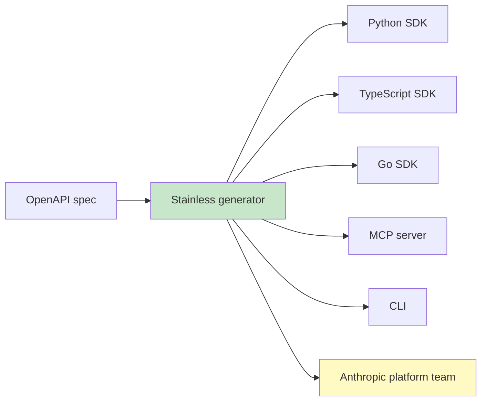

# Tools — 2026-05-28

## Anthropic acquires Stainless 

**Source:** [Anthropic](https://www.anthropic.com/news/anthropic-acquires-stainless) · [TechCrunch](https://techcrunch.com/2026/05/18/anthropic-has-acquired-the-dev-tools-startup-used-by-openai-google-and-cloudflare/) · [The New Stack](https://thenewstack.io/anthropic-stainless-sdk-acquisition/) · **Type:** acquisition · **Time (UTC):** May 18

Anthropic acquired Stainless, a New York startup founded in 2022 by former Stripe engineer Alex Rattray, for over $300 million. Stainless's product takes an OpenAPI specification and automatically generates idiomatic, well-tested SDKs across Python, TypeScript, Go, Java, and Kotlin, plus CLIs and MCP servers. Stainless had generated every official Anthropic SDK since the API's earliest days and also served OpenAI, Google, Cloudflare, and hundreds of other API companies. Anthropic will wind down all hosted Stainless products; customers retain full rights to previously generated SDKs. The Stainless team joins Anthropic's platform engineering group, focusing on agent runtime connectivity — the layer that lets Claude agents call external APIs and MCP servers.

**Why it matters:** By internalizing the SDK and MCP server generator used by its competitors, Anthropic simultaneously improves its own agent toolchain and removes a shared infrastructure layer OpenAI and Google relied on, forcing them to rebuild or migrate to alternatives.

---

## OpenAI Verify: C2PA + SynthID content provenance 

**Source:** [OpenAI](https://openai.com/index/advancing-content-provenance/) · [The Next Web](https://thenextweb.com/news/openai-c2pa-synthid-ai-image-detection-watermark) · [C2PA Viewer](https://c2paviewer.com/articles/openai-google-c2pa-synthid-2026) · **Type:** release · **Time (UTC):** May 19

OpenAI joined the C2PA standard steering committee and committed to embedding Google DeepMind's SynthID invisible watermark alongside C2PA Content Credentials in all images generated through ChatGPT and the OpenAI API. OpenAI simultaneously released a research-preview verification tool called **Verify** that accepts image uploads and checks for both signals. C2PA metadata records provenance chain (creator, tool, timestamps, edits) but is strippable; SynthID embeds an imperceptible watermark directly into pixel data that persists through common transforms. NVIDIA and several other companies adopted SynthID at the same time.

**Why it matters:** Two competing provenance standards converging on the same artifact pipeline from a single vendor simplifies integration for newsrooms, ad-verification systems, and content moderation pipelines — and sets a de facto baseline that other image-generation providers will face pressure to match.

---
