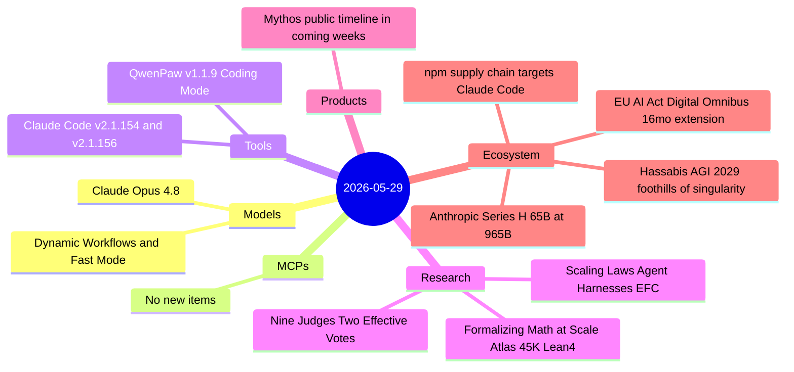
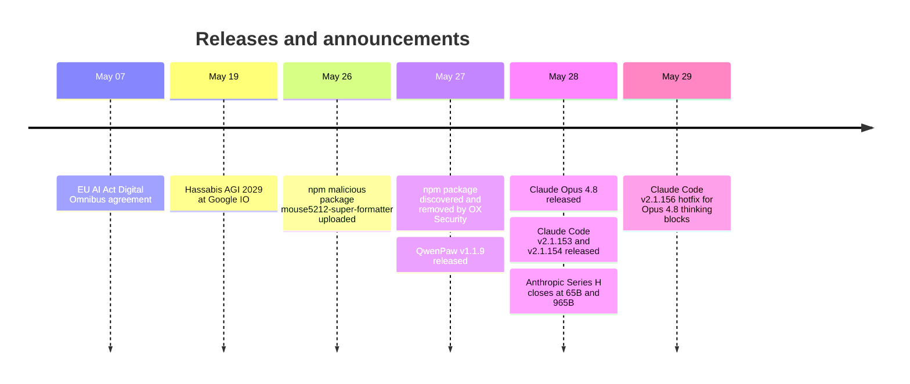

# AI Digest — 2026-05-29

> Anthropic's week closes with two simultaneous headline announcements: the formal close of its $65B Series H at a $965B post-money valuation — more than double the $30B estimate reported three days earlier — and the release of Claude Opus 4.8 with dynamic multi-agent workflows and Fast Mode. Three standout arXiv papers address multi-judge LLM evaluation panel failures (nine frontier judges deliver only ~2 independent votes of signal), automated formalization of 45,000+ Lean 4 math declarations at scale, and a new agent scaling-law framework based on feedback quality rather than raw compute. Overall the day runs moderate at 11 items, with activity concentrated almost entirely around Anthropic.

## Day at a glance

## Top stories

1. **Anthropic closes $65B Series H at $965B valuation** — Final close is more than double earlier $30B estimates, with $47B run-rate revenue and $15B from hyperscalers; positions Anthropic as the world's highest-valued private AI company at the threshold of a $1T IPO. [→ details](ecosystem.md#anthropic-series-h)
2. **Claude Opus 4.8 released with dynamic multi-agent workflows** — Dynamic Workflows orchestrate tens-to-hundreds of background agents from a `/workflows` command; Fast Mode at 2.5× throughput; pricing unchanged at $5/$25 per 1M tokens. [→ details](models.md#claude-opus-4-8)
3. **"Nine Judges, Two Effective Votes"** — Nine frontier LLM judges from seven families provide only ~2 independent votes of signal due to correlated errors; a single best judge matches or beats the full panel — key finding for anyone running LLM-as-judge evaluation pipelines. [→ details](research.md#nine-judges-two-effective-votes)

## By the numbers

| Category   | Items | Highlight |
|------------|------:|-----------|
| Models     |     1 | Claude Opus 4.8: dynamic workflows, Fast Mode, xhigh effort default |
| MCPs       |     0 | — |
| Tools      |     2 | Claude Code v2.1.154/v2.1.156; QwenPaw v1.1.9 Coding Mode |
| Research   |     3 | LLM judge correlation; math formalization at scale; agent EFC scaling |
| Products   |     1 | Mythos public availability timeline: "coming weeks" |
| Ecosystem  |     4 | Series H $65B; EU AI Act extension; Hassabis AGI 2029; npm stealer |

## Timeline (UTC)

## Files
- [Models](models.md)
- [MCPs](mcps.md)
- [Tools](tools.md)
- [Research](research.md)
- [Products](products.md)
- [Ecosystem](ecosystem.md)
