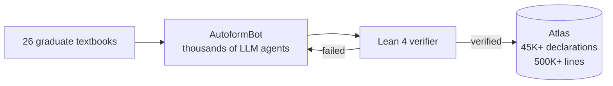

# Research — 2026-05-29

## Nine Judges, Two Effective Votes: Correlated Errors Undermine LLM Evaluation Panels 

**Source:** [arXiv:2605.29800](https://arxiv.org/abs/2605.29800) · **Type:** paper · **Time (UTC):** May 29

Guneet Kohli tests nine frontier models from seven provider families as evaluation judges on natural language inference tasks and finds the panel delivers only about two independent votes' worth of signal. Panel accuracy falls 8–22 percentage points below what genuinely independent judges would achieve. The best single judge matched or exceeded the full nine-model panel on all test conditions. Adding judges or using sophisticated aggregation (plurality, ranked-choice, Condorcet) recovered at most 11% of the performance gap. The core failure is correlated errors: models from different providers systematically fail on the same test instances, not on different ones.

**Why it matters:** Multi-model judge pipelines (e.g., three LLMs independently scoring outputs and averaging) are a common evaluation pattern, but this work shows they deliver far less diversity than assumed. A single well-calibrated judge is often equivalent to a nine-model panel; genuine evaluation improvements require architecturally diverse judges, held-out human annotation, or task-specific calibration — not simply more models.

---

## Formalizing Mathematics at Scale 

**Source:** [arXiv:2605.29955](https://arxiv.org/abs/2605.29955) · **Type:** paper · **Time (UTC):** May 29

Ahmad Rammal, Niket Patel, Fabian Gloeckle (Meta FAIR), Amaury Hayat, Julia Kempe (Meta FAIR), Rémi Munos (Google DeepMind), Charles Arnal, and Vivien Cabannes introduce AutoformBot — a multi-agent system that coordinates thousands of LLM agents equipped with Lean 4 verification tools and shared version control to autoformalize textbook mathematics. Applied to 26 open-access graduate-level textbooks spanning analysis, algebra, topology, combinatorics, and probability, the system produced Atlas: a publicly released library of 45,000+ verified Lean 4 declarations and 500,000+ lines of formally proved code. The authors state that autoformalizing graduate-level mathematics at scale is now "economically and technically feasible."

**Why it matters:** Atlas is the largest machine-verified mathematics library produced primarily by AI, and the AutoformBot architecture (thousands of parallel LLM agents coordinating via formal verification feedback loops) is a concrete example of the multi-agent patterns Opus 4.8 and similar models are designed to run. It extends the mathematical AI story from this week's AlphaProof Nexus result to the systematic, large-scale direction.

---

## Scaling Laws for Agent Harnesses via Effective Feedback Compute 

**Source:** [arXiv:2605.29682](https://arxiv.org/abs/2605.29682) · **Type:** paper · **Time (UTC):** May 29

Xuanliang Zhang, Dingzirui Wang, Keyan Xu, Qingfu Zhu, and Wanxiang Che (Harbin Institute of Technology) introduce Effective Feedback Compute (EFC) — a metric that counts only feedback that is informative, valid, non-redundant, and retained for subsequent decisions. EFC explains 94–99% of performance variance (R² up to 0.99) versus 33–42% for raw tokens or tool calls. In controlled experiments, optimizing for feedback quality raised agent task success from 27% to 90% with the same computational budget.

**Why it matters:** Token counts and tool-call tallies are poor predictors of agent task success; EFC gives engineers a diagnostic for why two agents with similar compute costs can have wildly different success rates, and points to feedback loop quality — not raw scale — as the primary optimization target for production agent systems.

---
