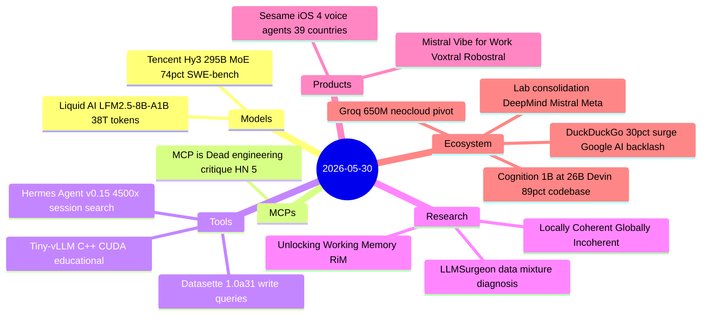
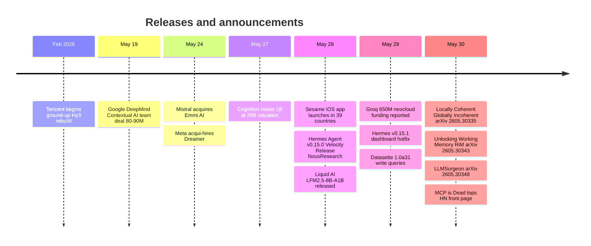

# AI Digest — 2026-05-30

> Cognition's $1B raise at a $26B valuation — backed by Devin now writing 89% of Cognition's own codebase and $492M ARR — marks a concrete crossing point for autonomous coding agents. Liquid AI and Tencent each released competitive open-weight models (LFM2.5-8B-A1B and Hy3), while three previously unreported lab acquisitions from the week of May 18–24 complete the consolidation picture alongside Anthropic/Stainless: Google DeepMind absorbed the Contextual AI team for $80–90M, Mistral acquired physics-specialist Emmi AI, and Meta acqui-hired Dreamer — all three structured to avoid antitrust merger review. A measured engineering critique of MCP reached HN #5, citing 10.5% context overhead and 9× first-call latency versus direct API access.

## Day at a glance

## Top stories

1. **Cognition raises $1B at $26B — Devin writes 89% of its own codebase** — The most concrete autonomous-agent revenue metric yet: $492M ARR, 50% MoM enterprise growth for six months, customers at Mercedes-Benz, NASA, Goldman Sachs; the 89% self-authorship figure is the strongest public signal the agentic coding loop is closing on itself. [→ details](ecosystem.md#cognition-1b-raise)

2. **AI lab consolidation wave: three more antitrust-structured deals** — In the same week as Anthropic's Stainless acquisition, Google DeepMind bought the Contextual AI team for $80–90M (Douwe Kiela + 20+ RAG researchers), Mistral acquired physics-AI startup Emmi AI (30+ researchers, fluid dynamics / heat transfer simulation), and Meta acqui-hired Dreamer — all structured as technology licenses to sidestep merger review. [→ details](ecosystem.md#lab-consolidation-wave)

3. **Liquid AI LFM2.5-8B-A1B: 38T tokens, 128K context, open-weight** — An 8B/A1B MoE with MATH500 at 88.76 and AIME25 at 42.53 that matches Gemma-4-26B instruction-following with ~4× fewer active parameters; 253 tok/s on Apple M5 Max, day-one llama.cpp/MLX/vLLM support. [→ details](models.md#liquid-ai-lfm2-5)

## By the numbers

| Category  | Items | Highlight |
|-----------|------:|-----------|
| Models    |     2 | Liquid AI LFM2.5-8B-A1B: 38T training, 128K ctx, edge-ready |
| MCPs      |     1 | Quandri: 10.5% context overhead, 9.4× first-call latency penalty |
| Tools     |     3 | Hermes Agent v0.15: 4,500× session_search, Kanban multi-agent |
| Research  |     3 | RiM: reasoning without token generation; compositional incoherence metric |
| Products  |     2 | Sesame iOS: 4 voice agents, 39 countries; Mistral Vibe for Work launch |
| Ecosystem |     4 | Cognition $1B/$26B; Groq $650M neocloud; 3-lab acquisition wave |

## Timeline (UTC)

## Files
- [Models](models.md)
- [MCPs](mcps.md)
- [Tools](tools.md)
- [Research](research.md)
- [Products](products.md)
- [Ecosystem](ecosystem.md)
