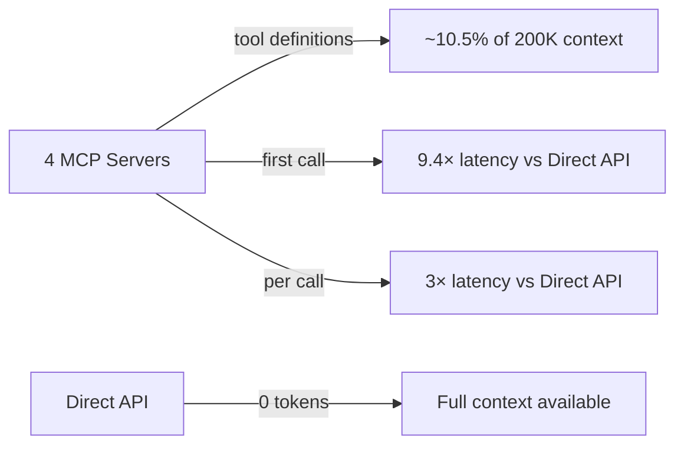

# MCPs — 2026-05-30

## "MCP is Dead?" — Engineering Critique from Quandri 

**Source:** [Quandri Engineering Blog](https://www.quandri.io/engineering-blog/mcp-is-dead) · **Type:** analysis · **Time (UTC):** —

A Quandri engineering post reached #5 on Hacker News (212 points) with a data-backed critique of MCP in production workflows. Three measured problems: (1) **context overhead** — four connected MCP servers consumed 10.5% of Claude's 200K context window, with the Linear server alone using 12,800 tokens across 42 tool definitions; (2) **latency** — MCP was 3× slower per call and 9.4× slower on first call versus direct API access due to external server round-trips; (3) **reliability** — init failures, re-auth loops, mid-session crashes. The proposed alternatives are a CLI-first pattern (existing CLIs waste no context on tool definitions) and the Skills pattern (load instructions on demand rather than keeping all definitions active). The post explicitly carves out a production-systems exception: MCP remains valuable where credential protection and safety guardrails are needed.

**Why it matters:** This is the most cited engineering post questioning MCP's practical value since the NSA security guidance last week. The context-consumption data is concrete enough to inform deployment decisions — teams running four or more MCP servers are burning a non-trivial fraction of context budget before the first user message. The criticism is directional rather than categorical; the Skills-over-MCP framing aligns with patterns already in Claude Code's own tooling.

---
