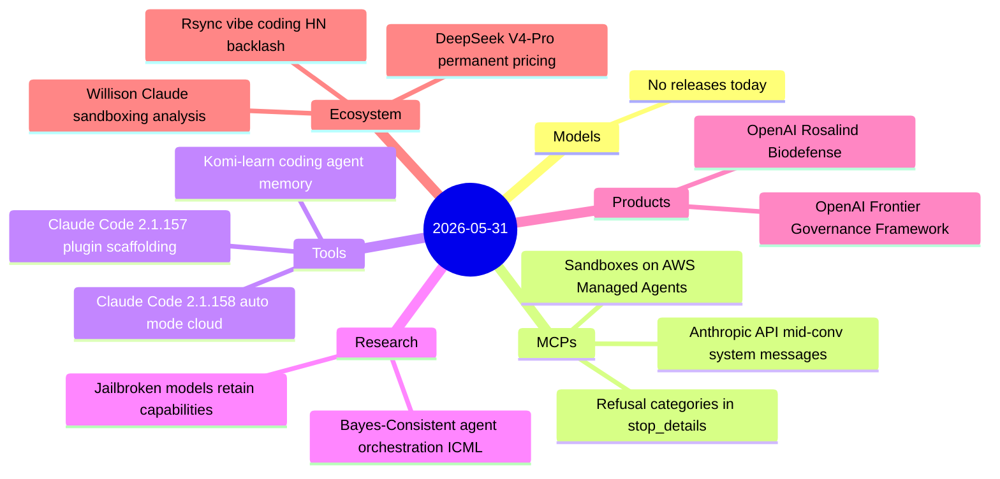
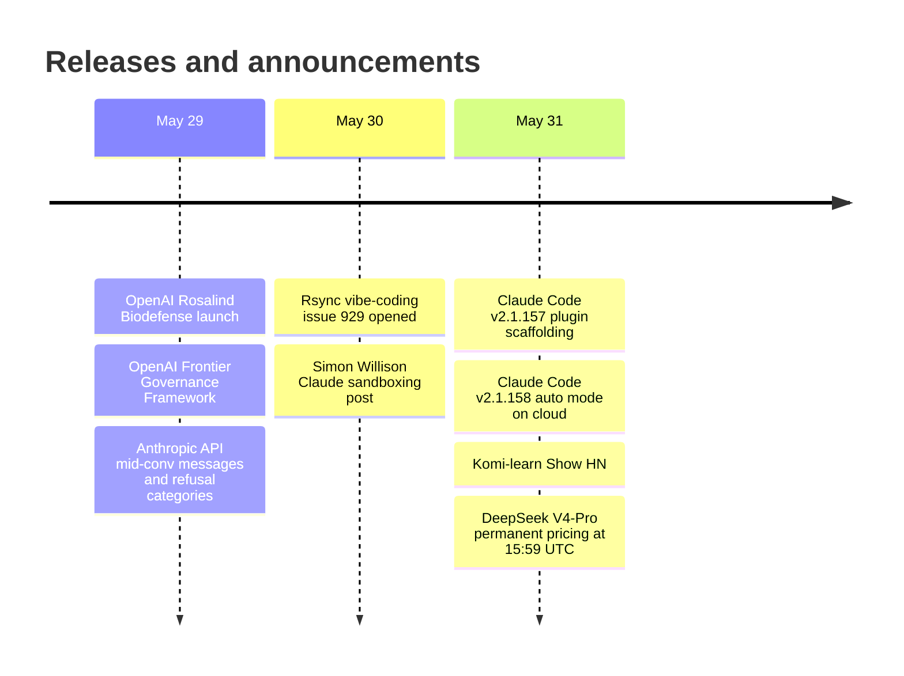

# AI Digest — 2026-05-31

> A moderate day across 11 items: the defining story is the rsync 3.4.3 controversy on Hacker News, where hundreds of Claude commits introduced regressions in 30-year-old infrastructure code and crystallized a widening debate about vibe coding in high-reliability open-source projects. OpenAI launched Rosalind Biodefense — a free life-sciences model for vetted pandemic-preparedness teams — and published its first formal regulatory alignment document. Claude Code shipped two releases (v2.1.157/v2.1.158) with plugin scaffolding and auto mode on all three hyperscaler platforms, while DeepSeek's V4-Pro 75% price cut became permanent list pricing today.

## Day at a glance

## Top stories

1. **Rsync 3.4.3 vibe coding backlash reaches HN front page** — Hundreds of Claude-assisted commits in rsync 3.4.3 produced regressions in decades-old functionality; a GitHub issue and HN thread (153 pts, 63 comments) are adding momentum to the informal open-source norm against AI code in high-reliability infrastructure. [→ details](ecosystem.md#rsync-vibe-coding)

2. **OpenAI launches Rosalind Biodefense with free GPT-Rosalind access** — A life-sciences reasoning model specialized for biology and pandemic preparedness is offered free to vetted government, academic, and nonprofit partners; day-one participants include LLNL, Johns Hopkins APL, and CEPI. [→ details](products.md#openai-rosalind-biodefense)

3. **Claude Code v2.1.157/v2.1.158: plugin scaffolding + auto mode on cloud providers** — Local plugin scaffolding removes the marketplace requirement for custom skills; auto mode reaches Bedrock, Vertex, and Foundry for the first time. [→ details](tools.md#claude-code-2-1-157-158)

## By the numbers

| Category   | Items | Highlight |
|------------|------:|-----------|
| Models     |     0 | Quiet day — no new model releases |
| MCPs       |     1 | Anthropic API: mid-conv system messages, refusal categories, AWS sandboxes |
| Tools      |     3 | Claude Code 2.1.157/158; Komi-learn persistent memory |
| Research   |     2 | Jailbreak tax near-zero on frontier models; Bayesian orchestration ICML |
| Products   |     2 | OpenAI Rosalind Biodefense; Frontier Governance Framework |
| Ecosystem  |     3 | Rsync vibe-coding; DeepSeek permanent $0.87/M output; Willison analysis |

## Timeline (UTC)

## Files
- [Models](models.md)
- [MCPs](mcps.md)
- [Tools](tools.md)
- [Research](research.md)
- [Products](products.md)
- [Ecosystem](ecosystem.md)
