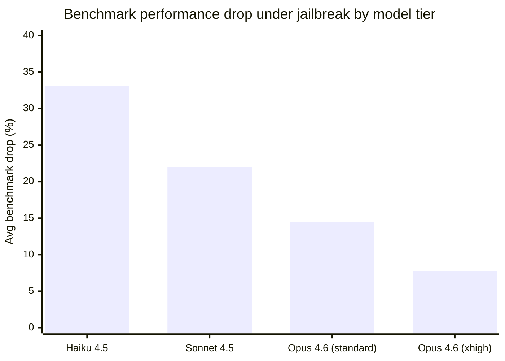

# Research — 2026-05-31

## Jailbroken frontier models retain their capabilities 

**Source:** [arXiv:2605.00267](https://arxiv.org/abs/2605.00267) · **Type:** paper · **Time (UTC):** submitted Apr 30, revised May 4; circulating widely May 31

Authors: Daniel Zhu, Zihan Wang, Xuchan Bao, Jerry Wei

Prior work found that complex jailbreaks impose a "jailbreak tax" — degraded benchmark performance — on successfully manipulated models, suggesting that safety and capability are partially coupled. This paper tests whether that coupling holds for frontier models. Evaluating 28 jailbreaks across five benchmarks on Claude models ranging from Haiku 4.5 to Opus 4.6 at max thinking effort, the authors find that the tax scales inversely with model capability. Haiku 4.5 loses an average of 33.1% on benchmark tasks when jailbroken; Opus 4.6 at xhigh effort loses only 7.7%.

**Why it matters:** The implication is directly counter-intuitive for safety policy: the models most likely to be deployed in high-stakes contexts are also the ones where a successful jailbreak causes the smallest observable capability drop, making the failure mode harder to detect by monitoring output quality alone.

---

## Position: Bayes-consistent agent orchestration (ICML 2026) 

**Source:** [arXiv:2605.00742](https://arxiv.org/abs/2605.00742) · **Type:** paper · **Time (UTC):** —

Authors: Papamarkou et al. (multi-institutional, accepted ICML 2026)

This position paper argues that current multi-agent orchestration frameworks — LangGraph, CrewAI, AutoGen, and similar — make implicit probabilistic assumptions that are neither stated nor enforced, leading to brittle coordination behavior under distribution shift. The authors propose that agent orchestration should be designed around Bayesian consistency constraints: beliefs about sub-agent outputs must update coherently, and scheduling decisions must be justifiable under an explicit joint probability model. The paper provides a taxonomy of consistency violations observed in existing frameworks and sketches a minimal mathematical foundation.

**Why it matters:** As multi-agent systems move to production, silent inconsistency between agents is an underappreciated failure mode. An ICML-accepted position paper calling for probabilistic foundations is likely to influence how orchestration frameworks are designed in the next generation of tooling.

---
