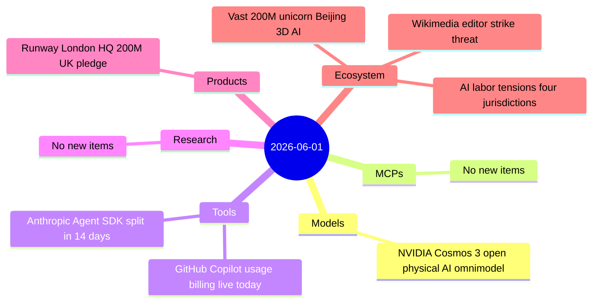

# AI Digest — 2026-06-01

> The headline developer story today is structural: GitHub Copilot's flat-fee era ends as usage-based billing goes live, replacing premium request units with AI Credits metered by token consumption and — for the first time — routing Copilot code reviews through GitHub Actions minutes. NVIDIA shipped Cosmos 3 at GTC Taipei, the first fully open omnimodel for physical AI with native action generation, licensed under OpenMDW 1.1 and ranking first on seven robotics and AV benchmarks. On the business side, 3D AI startup Vast reached unicorn status at ~$200M total funding, Runway planted its European flag in London with a $200M+ UK pledge, and a simultaneous wave of AI-and-work disputes across Amazon, Chinese courts, the UK, and Wikimedia surfaced the same underlying tension in four different forms. Model releases and research were quiet — Gemini 3.5 Pro remains in limited Vertex preview, and arXiv showed no new cs.AI submissions for the date.

## Day at a glance



## Top stories

1. **GitHub Copilot usage-based billing goes live** — AI Credits replace PRUs effective today; chat and agentic sessions are now metered by token at API rates, while code completions stay flat; Copilot code review also begins consuming Actions minutes on private repos — engineers running long agentic sessions should audit spend immediately. [→ details](tools.md#copilot-usage-billing)
2. **NVIDIA Cosmos 3: open omnimodel for physical AI** — Mixture-of-transformers architecture with native action generation (joint angles, trajectories) released under OpenMDW 1.1 (Linux Foundation); Cosmos 3 Super and Nano available now on HuggingFace/GitHub/NIM; ranks first on Physics-IQ, RoboLab, and five other open-model benchmarks; six-lab Cosmos Coalition formed. [→ details](models.md#nvidia-cosmos-3)
3. **Anthropic Agent SDK billing split: 14 days out** — Developer community is actively sharing workarounds as the June 15 date approaches; community calculations put the effective cost increase at 12×–175× for heavy agentic workloads; $20 Pro credit ceiling can be exhausted by a CI pipeline in days. [→ details](tools.md#anthropic-agent-sdk-billing)

## By the numbers

| Category   | Items | Highlight |
|------------|------:|-----------|
| Models     |     1 | Cosmos 3: open physical AI omnimodel, OpenMDW 1.1, 7 benchmark leads |
| MCPs       |     0 | — |
| Tools      |     2 | Copilot usage billing live; Anthropic SDK split in 14 days |
| Research   |     0 | Quiet day — no cs.AI/cs.CL arXiv submissions |
| Products   |     1 | Runway London HQ: $200M+ UK pledge through 2028 |
| Ecosystem  |     3 | Vast $1B+ unicorn; Wikimedia strike; AI labor tensions |

## Timeline (UTC)

```mermaid
timeline
  title Releases & announcements
  section May 31
    01:00 : NVIDIA Cosmos 3 announced at GTC Taipei
  section June 1
    00:00 : GitHub Copilot usage-based billing activated
          : Cosmos 3 weights on HuggingFace and GitHub
    14:00 : Runway London HQ announced
          : Vast unicorn status reported by Bloomberg
```

## Files
- [Models](models.md)
- [MCPs](mcps.md)
- [Tools](tools.md)
- [Research](research.md)
- [Products](products.md)
- [Ecosystem](ecosystem.md)
