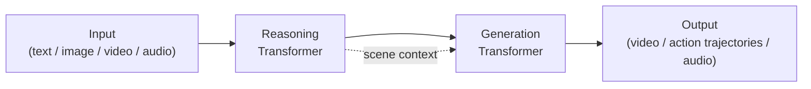

# Models — 2026-06-01

## NVIDIA Cosmos 3 

**Source:** [NVIDIA Newsroom](https://nvidianews.nvidia.com/news/nvidia-launches-cosmos-3-the-open-frontier-foundation-model-for-physical-ai) · **Type:** release · **Time (UTC):** ~09:00 (GTC Taipei, May 31 announcement; weights available June 1)

NVIDIA announced Cosmos 3 at GTC Taipei during Computex, describing it as the first fully open omnimodel for physical AI. The architecture pairs a reasoning transformer with an expert generation transformer under the name "mixture-of-transformers," letting the model understand object interactions and spatial-temporal relationships before generating output. Natively multimodal, it accepts and emits text, images, video, ambient sound, and action trajectories (joint angles, gripper positions, trajectory waypoints). Three variants ship at launch: Cosmos 3 Super for highest-accuracy post-training on robotics and AV models, Cosmos 3 Nano for sub-second video and action inference, and Cosmos 3 Edge (listed as coming soon) for real-time on-device deployment.

Among open models, Cosmos 3 claims first place on Physics-IQ, PAI-Bench, R-Bench (world generation), RoboLab and RoboArena (action policy), and VANTAGE-Bench and TAR (smart-infrastructure and traffic-anomaly understanding). Training consumed billions of samples spanning all five modalities.

Weights, architecture, documentation, datasets, and code are released under OpenMDW 1.1 from the Linux Foundation — a true open-source license permitting training, modification, redistribution, and commercial deployment. Distribution channels include build.nvidia.com, Hugging Face, GitHub, and NVIDIA NIM microservices.

NVIDIA simultaneously launched the **Cosmos Coalition**, a founding group of six partner labs — Agile Robots, Black Forest Labs, Generalist, LTX, Runway, and Skild AI — committing to jointly advance open world models on top of the Cosmos 3 base.

**Why it matters:** Cosmos 3 is the first open model with a unified action-prediction head, removing a key barrier for robotics teams that previously needed separate perception and policy models. The OpenMDW 1.1 license means teams can fine-tune on proprietary datasets and deploy commercially without royalties — a meaningful advantage over the proprietary physical-AI stacks from Boston Dynamics and Figure.

| Variant | Use case | Latency |
|---------|----------|---------|
| Cosmos 3 Super | Post-training; AV/robotics fine-tuning | — |
| Cosmos 3 Nano | Real-time action inference | Sub-second |
| Cosmos 3 Edge | On-device edge deployment | Coming soon |

---
