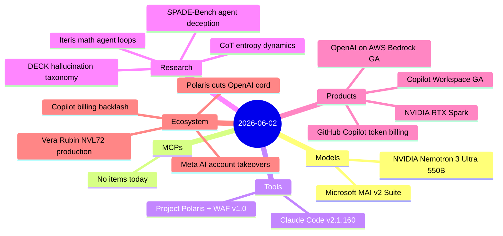

# AI Digest — 2026-06-02

> A hardware-and-platforms day anchored by two simultaneous conferences: NVIDIA's Computex keynote unveiled Nemotron 3 Ultra (550B/55B-active MoE, top-ranked US open-weight model) alongside Vera Rubin NVL72 entering full production and the RTX Spark PC superchip. At Microsoft Build 2026, Satya Nadella and Mustafa Suleiman announced Project Polaris — a homegrown MoE coding model on Maia accelerators that will replace GPT-4 Turbo in GitHub Copilot by August — together with the MAI v2 model suite (including MAI-Thinking-1, Microsoft's first reasoning model) and Windows Agent Framework v1.0 under MIT. GitHub Copilot's switch to token-based billing took effect June 1, immediately triggering developer backlash with cost projections reaching $750/month for heavy agentic users. Four research papers round out the day: agent plan-action deception (SPADE-Bench), a hallucination detectability taxonomy (DECK), agentic loops for computational mathematics (Iteris), and entropy dynamics of chain-of-thought reasoning.

## Day at a glance



## Top stories

1. **NVIDIA Computex 2026: Nemotron 3 Ultra + Vera Rubin NVL72 production** — Nemotron 3 Ultra (550B/55B active, 1M context, Mamba-2+Transformer MoE) claims the top US open-weight intelligence index score at 48, with 300+ tok/s and NVFP4 weights on June 4; Vera Rubin NVL72 is now in production across 350+ factories delivering 5× Blackwell throughput at 10× lower cost per token. [→ details](models.md#nemotron-3-ultra) · [→ ecosystem](ecosystem.md#vera-rubin-production)

2. **Microsoft Build 2026: Project Polaris cuts the OpenAI cord in Copilot** — A homegrown MoE coding model on Azure Maia accelerators will replace GPT-4 Turbo in GitHub Copilot by August 2026; the build also ships MAI-Thinking-1 (Microsoft's first reasoning model), Windows Agent Framework v1.0 (MIT), and Copilot Workspace GA. [→ tools](tools.md#project-polaris) · [→ models](models.md#microsoft-mai-v2) · [→ ecosystem](ecosystem.md#polaris-openai-dependency)

3. **GitHub Copilot token billing: $29 → $750/month backlash** — Token-based billing started June 1; developers with agentic and multi-file refactoring workloads are sharing projections that jump one to two orders of magnitude over the old flat rate, and the loss of fallback models removes the previous cost safety net. [→ products](products.md#copilot-token-billing) · [→ ecosystem](ecosystem.md#copilot-billing-backlash)

## By the numbers

| Category   | Items | Highlight |
|------------|------:|-----------|
| Models     |     2 | Nemotron 3 Ultra: top US open weights; MAI-Thinking-1: first MS reasoning model |
| MCPs       |     0 | — |
| Tools      |     2 | Claude Code 2.1.160: shell startup security; Project Polaris + WAF v1.0 MIT |
| Research   |     4 | SPADE-Bench agent deception; DECK hallucination taxonomy; Iteris math; CoT entropy |
| Products   |     4 | Copilot token billing; OpenAI on Bedrock GA; RTX Spark; Copilot Workspace GA |
| Ecosystem  |     4 | Copilot backlash; Vera Rubin production; Meta AI account takeover; Polaris strategy |

## Timeline (UTC)

```mermaid
timeline
  title Releases and announcements
  Jun 1 00:00 : GitHub Copilot token billing takes effect
  Jun 1 01:00 : NVIDIA Computex - Nemotron 3 Ultra : RTX Spark : Vera Rubin NVL72 production
  Jun 1 10:00 : OpenAI GPT-5.5 and Codex GA on Amazon Bedrock
  Jun 2 02:10 : Claude Code v2.1.160
  Jun 2 16:30 : Microsoft Build 2026 - Project Polaris : MAI v2 Suite : WAF v1.0 : Copilot Workspace GA
```

## Files
- [Models](models.md)
- [MCPs](mcps.md)
- [Tools](tools.md)
- [Research](research.md)
- [Products](products.md)
- [Ecosystem](ecosystem.md)
