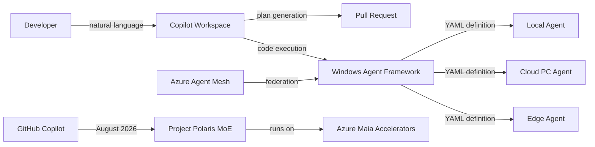

# Tools — 2026-06-02

## Claude Code v2.1.160 

**Source:** [anthropics/claude-code GitHub Releases](https://github.com/anthropics/claude-code/releases) · **Type:** release · **Time (UTC):** 02:10 Jun 2

Two security-focused changes lead this release. First, Claude Code now prompts before writing to shell startup files (`.zshenv`, `.zlogin`, `.bash_login`) and `~/.config/git/`, preventing unintended command execution on session start. Second, `acceptEdits` mode prompts before modifying build-tool config files that implicitly grant code execution: `.npmrc`, `.yarnrc*`, `bunfig.toml`, `.bazelrc`, `.pre-commit-config.yaml`, and `.devcontainer/`. The dynamic-workflow trigger keyword renamed from `workflow` to `ultracode`. Additional fixes: single-file grep now satisfies the read-before-edit check (eliminating a redundant `Read` step); WSL clipboard writing switched from OSC 52 to PowerShell interop; background session chat history no longer lost after overnight restarts.

**Why it matters:** The shell startup and build-config prompts close a class of supply-chain-style attacks where a malicious project could persist arbitrary commands through dotfiles or package manager hooks — a realistic concern for developers running Claude Code across multiple repositories.

---

## Microsoft Project Polaris and Windows Agent Framework v1.0 

**Source:** [ChatForest Build 2026 Recap](https://chatforest.com/builders-log/microsoft-build-2026-recap-windows-agent-platform-project-polaris-copilot-workspace/) · [Microsoft Build / Digit.in](https://www.digit.in/news/general/microsoft-build-2026-new-ai-models-copilot-super-app-and-what-more-to-expect.html) · **Type:** release · **Time (UTC):** ~16:30 Jun 2

**Project Polaris** is Microsoft's homegrown mixture-of-experts coding model, built on language-specific expert modules and running entirely on Azure's Maia AI accelerators. It will replace GPT-4 Turbo as the default model powering GitHub Copilot starting August 2026. The Pro tier offers 100,000-line multi-file context and autonomous test generation. This is the first Microsoft coding model operating without a real-time OpenAI dependency.

**Windows Agent Framework (WAF) v1.0**, released under an MIT license, is a developer SDK for building agents that run across local Windows, Cloud PCs, and edge devices from a single YAML agent definition. It supports ambient agents for continuous background operation. An associated Windows Agent Store provides distribution with 85% revenue share and mandatory security review. **Azure Agent Mesh** (preview, GA targeted Q4 2026) federates agent execution across on-premises, Cloud PC, and edge via a consumption-priced control plane.

**GitHub Copilot Workspace** reached general availability at Build after a year in beta. It accepts natural-language descriptions of bugs or features, produces a plan, modifies the relevant files, and opens a pull request. Fleet mode enables autonomous operation on narrowly scoped tasks; autopilot mode schedules background work on open issues. Integrations ship day-one for Jira, Datadog, and ServiceNow.

**Why it matters:** Project Polaris is the concrete first step in Microsoft reducing its GPT dependency in production developer tooling, a strategic shift that coincides with Copilot's billing controversy (see [ecosystem.md](ecosystem.md#polaris-openai-dependency)). The Windows Agent Framework v1.0 provides a vendor-neutral, local-first alternative to cloud-only agent orchestration frameworks — especially notable given the agent-on-device positioning of the RTX Spark hardware announced simultaneously.

---
