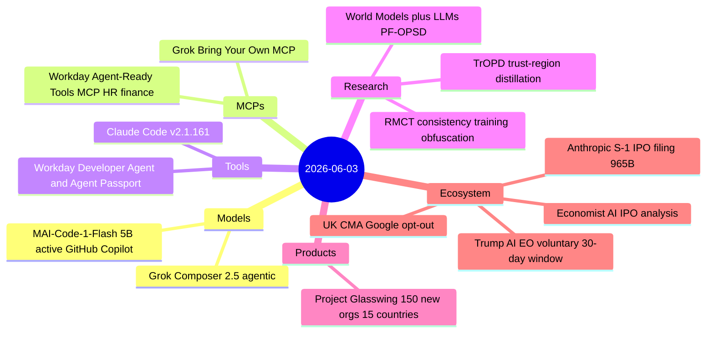
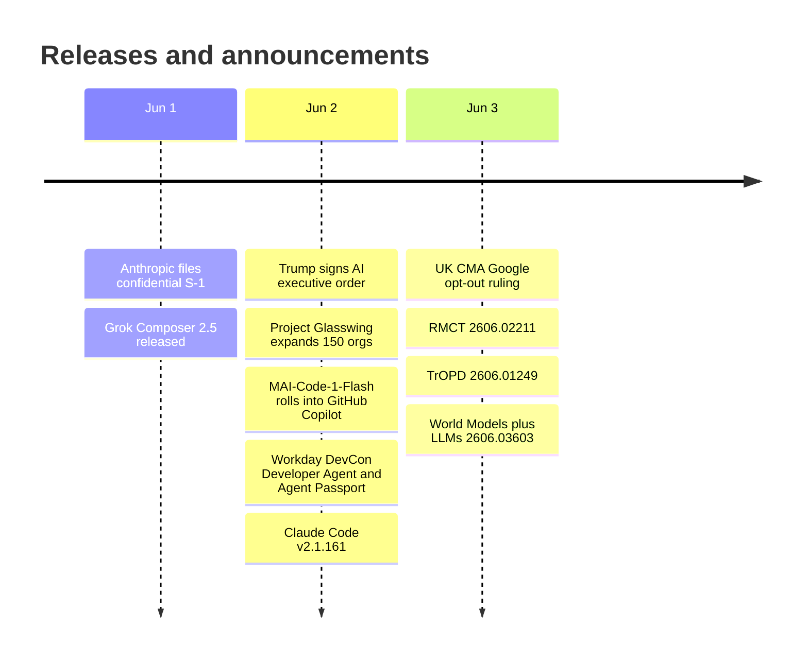

# AI Digest — 2026-06-03

> Anthropic filed a confidential S-1 with the SEC on June 1 — at $965B valuation, $47B ARR, and Q2 revenue projected to more than double Q1 — setting the stage for a potential October 2026 IPO, one day before expanding Project Glasswing's Claude Mythos cybersecurity program to 150 additional critical-infrastructure partners. In AI policy, Trump signed a deliberately softened executive order asking labs to voluntarily share frontier models with the government 30 days before release (cut from 90 days in earlier drafts), while the UK's CMA issued the first binding mandate requiring Google to give publishers an opt-out from AI Overviews within nine months. Model activity was moderate: Microsoft's MAI-Code-1-Flash (5B active params) began rolling into all GitHub Copilot plans with a 16-point SWE-Bench Pro lead over Claude Haiku 4.5, and xAI released Grok Composer 2.5 for long-running agentic tasks. A measured day at 14 items, policy events dominating the news cycle.

## Day at a glance

## Top stories

1. **Anthropic files confidential S-1 with the SEC** — At $965B valuation and $47B ARR, this is the first formal step toward an October 2026 IPO; Q2 2026 revenue is projected at $10.9B — more than double Q1's $4.8B — with a first-ever $559M operating profit in sight. [→ details](ecosystem.md#anthropic-ipo-s1)
2. **Trump signs voluntary AI executive order** — Labs are asked (not required) to submit frontier models for 30-day government evaluation before release; the order also establishes an AI cybersecurity clearinghouse across OSTP, NIST, and CISA but explicitly bars mandatory licensing. [→ details](ecosystem.md#trump-ai-eo)
3. **UK CMA mandates Google publisher opt-out from AI Overviews** — Britain's CMA sets a nine-month deadline for Google to implement publisher controls over AI Overviews summaries, AI model fine-tuning, and attribution — calling it "a world first." [→ details](ecosystem.md#uk-cma-google-opt-out)

## By the numbers

| Category   | Items | Highlight |
|------------|------:|-----------|
| Models     |     2 | MAI-Code-1-Flash: 16-pt SWE-Bench Pro lead over Claude Haiku 4.5 |
| MCPs       |     2 | Grok BYOMCP; Workday HR/finance data over MCP |
| Tools      |     2 | Claude Code 2.1.161: parallel-call fix, OTEL labels |
| Research   |     3 | RMCT obfuscation; TrOPD distillation stability; World Models + LLMs |
| Products   |     1 | Project Glasswing: 150 new orgs, 10K+ flaws found since launch |
| Ecosystem  |     4 | Anthropic S-1; Trump EO; UK CMA; Economist AI IPO analysis |

## Timeline (UTC)

## Files
- [Models](models.md)
- [MCPs](mcps.md)
- [Tools](tools.md)
- [Research](research.md)
- [Products](products.md)
- [Ecosystem](ecosystem.md)
