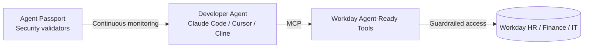

# MCPs — 2026-06-03

## Grok adds Bring Your Own MCP 

**Source:** [xAI](https://x.ai/news) · **Type:** feature release · **Time (UTC):** Jun 2

xAI added a "Bring Your Own MCP" option to Grok, allowing users and API consumers to connect any custom Model Context Protocol server to Grok agents. This rounds out MCP support across all major frontier-model providers: Claude, Gemini, Copilot, and now Grok all accept MCP-compatible tools and data sources without requiring proprietary adapter layers.

**Why it matters:** Developers who already have MCP servers can now target Grok-based workflows without reimplementing tool adapters; the completion of the major-lab baseline for MCP connectivity accelerates the MCP ecosystem flywheel — teams can now build once and run across all runtimes.

---

## Workday Agent-Ready Tools expose HR and finance data over MCP 

**Source:** [Workday newsroom](https://newsroom.workday.com/2026-06-02-Workday-Launches-New-Tools-for-Developers-to-Build,-Connect,-and-Verify-AI-Agents-For-HR,-Finance,-and-IT) · **Type:** launch · **Time (UTC):** Jun 2, ~13:00

At Workday DevCon 2026, Workday launched Agent-Ready Tools: guardrailed MCP endpoints exposing Workday's HR, finance, and IT data to external AI agents. The layer provides access scoping, audit logging, and policy enforcement rather than raw MCP pass-through. It is available in early access through Workday Extend Professional, with GA projected for H2 2026. Workday explicitly designed these endpoints to integrate with Claude Code, Cline, Cursor, and Google Antigravity via the open AgentSkills standard.

**Why it matters:** This is the first MCP rollout from a major enterprise ERP platform, giving coding agents sanctioned, policy-governed access to payroll, headcount, and financial records — a category of enterprise data that has been blocked from AI agent access precisely because no safe access layer existed.

---
