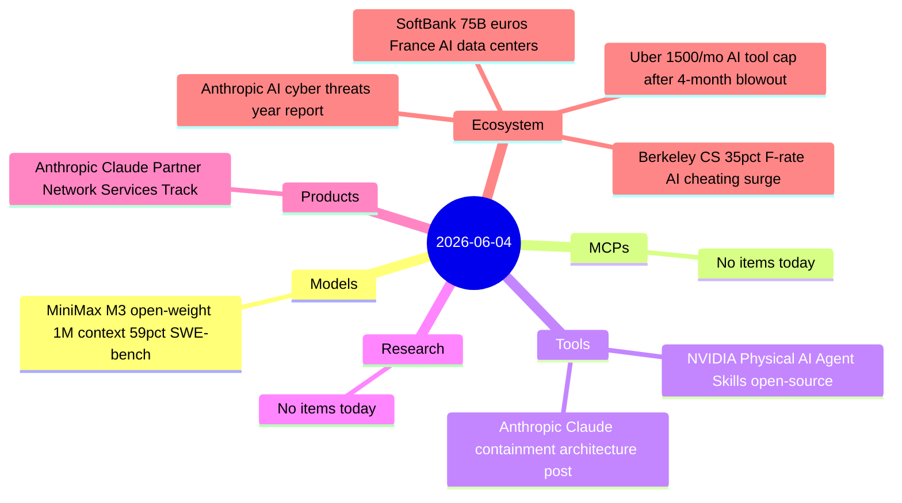
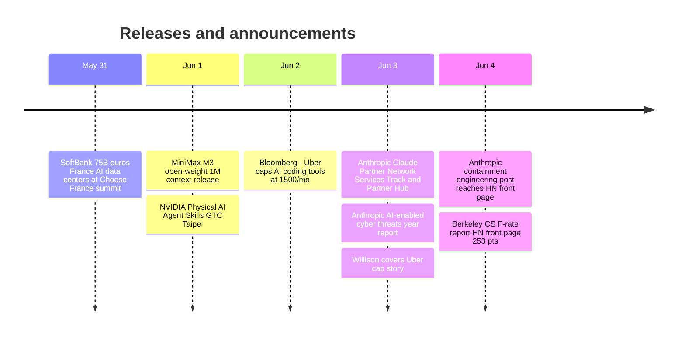

# AI Digest — 2026-06-04

> A moderate-volume day (8 items) dominated by safety and cost-management signals. Anthropic published two significant pieces: a year-long analysis of AI-enabled cyber threats (832 banned accounts, AI use by medium/high-risk actors up 1.7× in a year) and an engineering deep-dive into Claude's three-layer containment architecture, with a red-team result showing a phishing-injected prompt exfiltrated AWS credentials 24 of 25 attempts. On the enterprise side, Uber's decision to cap AI coding tool spending at $1,500/month — after burning its entire 2026 budget in four months — marks the first major public case of corporate token cost governance. MiniMax M3, released June 1 and not covered in prior digests, is the model story: an open-weight frontier with 1M context, sparse attention, and 59% SWE-Bench Pro at $0.60/M tokens.

## Day at a glance

## Top stories

1. **Anthropic AI Cyber Threats Report** — 832 banned accounts mapped to MITRE ATT&CK show AI use by medium/high-risk actors nearly doubled (33%→56%) in a year; MITRE ATT&CK's framework is now inadequate for classifying agentic attack orchestration. [→ details](ecosystem.md#anthropic-ai-cyber-threats-report)
2. **Uber $1,500/month AI coding cap** — Uber exhausted its entire 2026 AI budget in four months and is now the first major public enterprise to impose per-engineer token spending limits on Claude Code and Cursor, at rates enterprise customers pay without subscriber discounts. [→ details](ecosystem.md#uber-ai-spending-cap)
3. **MiniMax M3** — Open-weight, 1M context, native multimodal, MSA sparse attention (15.6× faster decode vs M2); 59% SWE-Bench Pro beats GPT-5.5 with weights releasing to Hugging Face shortly at $0.60/M input. [→ details](models.md#minimax-m3)

## By the numbers

| Category   | Items | Highlight |
|------------|------:|-----------|
| Models     |     1 | MiniMax M3: 59% SWE-Bench Pro, 1M ctx, $0.60/M, open-weight |
| MCPs       |     0 | — |
| Tools      |     2 | NVIDIA Physical AI Skills; Anthropic containment post (24/25 phishing success) |
| Research   |     0 | — |
| Products   |     1 | Claude Partner Network: 40K firms applied, 3-tier Services Track |
| Ecosystem  |     4 | Cyber threats report; Uber cap; Berkeley F-rates; SoftBank €75B France |

## Timeline (UTC)

## Files
- [Models](models.md)
- [MCPs](mcps.md)
- [Tools](tools.md)
- [Research](research.md)
- [Products](products.md)
- [Ecosystem](ecosystem.md)
