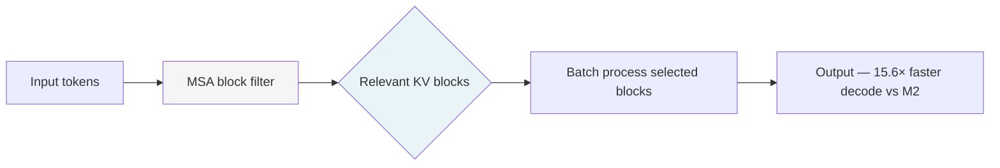

# Models — 2026-06-04

## MiniMax M3: open-weight frontier model with 1M context and sparse attention 

**Source:** [The Decoder](https://the-decoder.com/minimax-m3-open-weight-model-with-a-million-token-context-challenges-proprietary-leaders/) · [MiniMax blog](https://www.minimax.io/models/text/m27) · **Type:** release · **Time (UTC):** June 1, ~08:00

MiniMax released M3 on June 1, 2026 — the first open-weight model to combine frontier coding performance, a 1-million-token context window, and native multimodal input (text, image, video) in a single model. The architectural core is MiniMax Sparse Attention (MSA), which pre-filters the KV cache into blocks and processes only the relevant subset: 1/20th the compute at the million-token length, 9.7× faster prefill, and 15.6× faster decoding compared with M2. The model can operate a desktop computer autonomously and has demonstrated multi-hour independent work on complex tasks.

**Why it matters:** M3 scores 59.0% on SWE-Bench Pro — edging past GPT-5.5 (58.6%) and Gemini 3.1 Pro, and 83.5 on BrowseComp (above Opus 4.7's 79.3). At $0.60/M input tokens with weights releasing on Hugging Face and GitHub, it's the most capable open-weight coding option at this price point. Independent benchmark replication is still pending (several MiniMax-reported scores used internal scaffolding).

| Benchmark | M3 | GPT-5.5 | Claude Opus 4.7 |
|-----------|---:|--------:|----------------:|
| SWE-Bench Pro | 59.0% | 58.6% | ~62% |
| BrowseComp | 83.5 | — | 79.3 |
| Terminal-Bench 2.1 | 66.0% | — | — |

---
