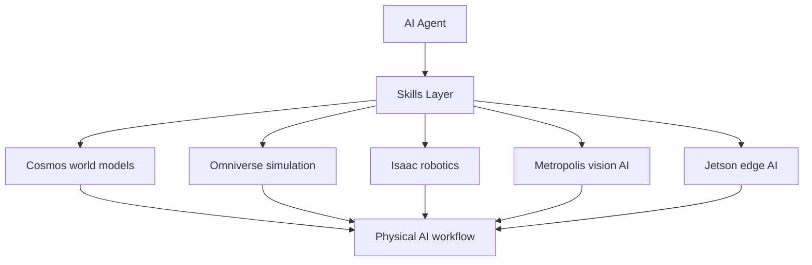
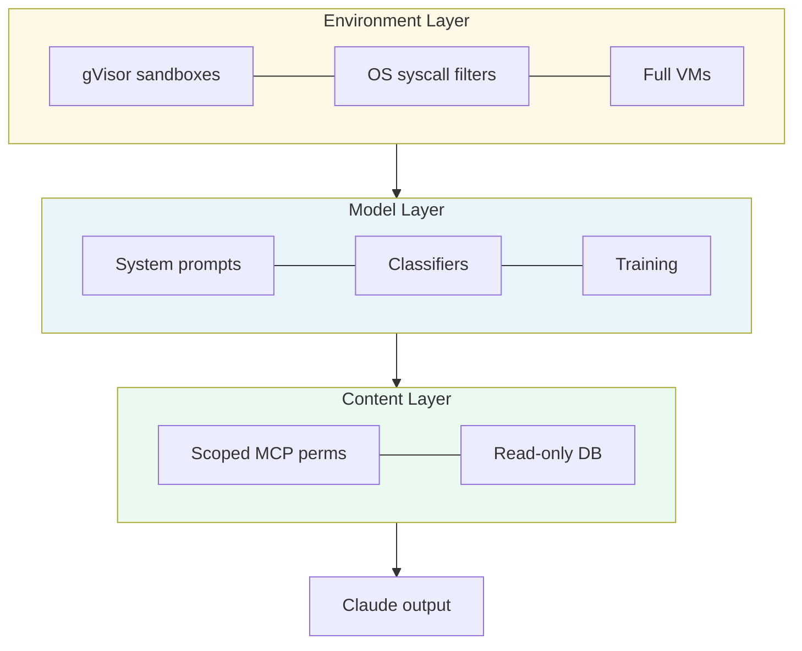

# Tools — 2026-06-04

## NVIDIA Physical AI Agent Skills: open-source toolkit for robotics and industrial AI 

**Source:** [NVIDIA Newsroom](https://nvidianews.nvidia.com/news/nvidia-releases-major-collection-of-open-source-agent-tools-and-skills-for-physical-ai) · **Type:** release · **Time (UTC):** June 1, ~14:00 (GTC Taipei)

NVIDIA released a collection of open-source physical AI skills and tools at GTC Taipei, hosted on [github.com/NVIDIA/skills](https://github.com/NVIDIA/skills) and accessible via skills.sh. The release decomposes complex physical AI workflows — robotics, autonomous vehicles, vision AI, and industrial digital twins — into discrete, agent-executable tasks. Skills wrap NVIDIA's existing libraries: Cosmos (world foundation models), Omniverse (simulation), Isaac (robotics), Metropolis (vision AI), Alpamayo (autonomous driving), and Jetson (edge AI). Each skill is available as a "Physical AI Launchable" on NVIDIA Brev for zero-setup testing.

**Why it matters:** This shifts physical AI development from hand-coded pipelines to composable, agent-orchestrated workflows. Early adopters report concrete gains: Pegatron achieved 67% faster model training using synthetic data generation skills; Delta Electronics improved defect detection by 17%. For engineers building robotics or manufacturing automation, this provides a standardized, testable skill layer over NVIDIA's stack.

---

## Anthropic: "How we contain Claude across products" — engineering safety deep-dive 

**Source:** [Anthropic Engineering](https://www.anthropic.com/engineering/how-we-contain-claude) · **Type:** technical blog · **Time (UTC):** June 4 (HN front page: 117 pts, 51 comments)

Anthropic published a detailed engineering post describing the three-layer containment architecture applied across all Claude deployments. The **environment layer** uses hardware sandboxes — gVisor for claude.ai, OS-level syscall filtering (Seatbelt/bubblewrap) for Claude Code, full VMs for Claude Cowork. The **model layer** uses system prompts, classifiers, and training modifications; Opus 4.7 hits ~0.1% attack success on single prompt-injection attempts using Gray Swan benchmarks. The **content layer** restricts tool access via scoped MCP server permissions and read-only DB access. The post includes three historical incidents: pre-trust hook execution fixed by deferring configuration parsing until after user consent; a direct prompt injection that exfiltrated AWS credentials 24 of 25 times in an internal red-team exercise; and an allowlist bypass that used approved API endpoints to upload files to an attacker-controlled account. The core design principle: "the software you build yourself is often the weakest" component.

**Why it matters:** For developers building on Claude — especially with Claude Code or MCP integrations — the post documents the actual attack surface, what mitigations exist, and where the model layer cannot be the last line of defense. The 24/25 phishing-injection success rate is a concrete data point for threat modeling.

---
