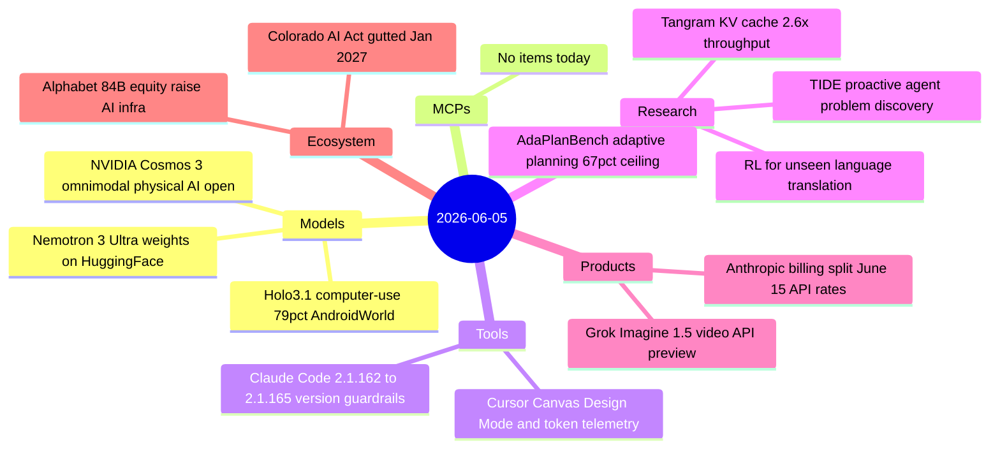
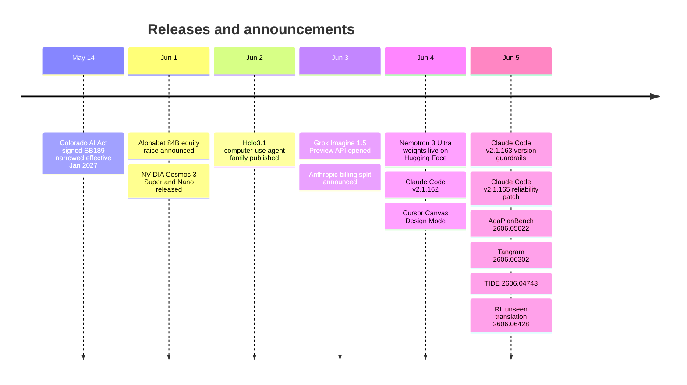

# AI Digest — 2026-06-05

> Alphabet's $84.75B equity raise for AI compute infrastructure — announced June 1 but not covered in prior digests — is the week's largest ecosystem story, committing more than the entire Anthropic valuation to a single year of GPU buildout. Anthropic announced a June 15 billing overhaul that moves Agent SDK, `claude -p`, and third-party agent usage to a separate monthly credit pool billed at API rates, ending the flat-rate programmatic access that subscription plans previously allowed. NVIDIA completed its back-to-back launch sprint: Cosmos 3, an open omnimodal world foundation model for physical AI, shipped June 1, and Nemotron 3 Ultra weights landed on Hugging Face on June 4. Research highlights include AdaPlanBench (best model: 67.75% on adaptive household planning), Tangram (2.6× KV-cache throughput via non-uniform compression), and a result showing RL post-training confers a generalizable translation meta-skill for unseen languages.

## Day at a glance

## Top stories

1. **Alphabet raises $84.75B in equity for AI infrastructure** — The largest equity raise in AI history by a public company, backing $180–190B in 2026 capex; anchored by a $10B Berkshire Hathaway private placement. [→ details](ecosystem.md#alphabet-equity-raise)
2. **Anthropic Agent SDK billing split effective June 15** — Programmatic Claude usage moves to a separate monthly credit pool at full API rates; Pro users get $20/month, Max 20× users get $200/month, non-rollover. [→ details](products.md#anthropic-billing-split)
3. **NVIDIA Cosmos 3: open omnimodal world foundation model for physical AI** — Trained on 20T tokens including action trajectories; ranks #1 on Physics-IQ, PAI-Bench, and RoboLab among open models; Super and Nano variants available now. [→ details](models.md#nvidia-cosmos-3)

## By the numbers

| Category   | Items | Highlight |
|------------|------:|-----------|
| Models     |     3 | Cosmos 3: omnimodal MoT, #1 Physics-IQ open; Holo3.1: 79.3% AndroidWorld |
| MCPs       |     0 | — |
| Tools      |     2 | Claude Code 2.1.163: version guardrails; Cursor: canvas token telemetry |
| Research   |     4 | AdaPlanBench: 67.75% frontier ceiling; Tangram: 2.6× KV-cache throughput |
| Products   |     2 | Anthropic billing split; Grok Imagine 1.5 video API |
| Ecosystem  |     2 | Alphabet $84.75B equity; Colorado AI Act gutted |

## Timeline (UTC)

## Files
- [Models](models.md)
- [MCPs](mcps.md)
- [Tools](tools.md)
- [Research](research.md)
- [Products](products.md)
- [Ecosystem](ecosystem.md)
