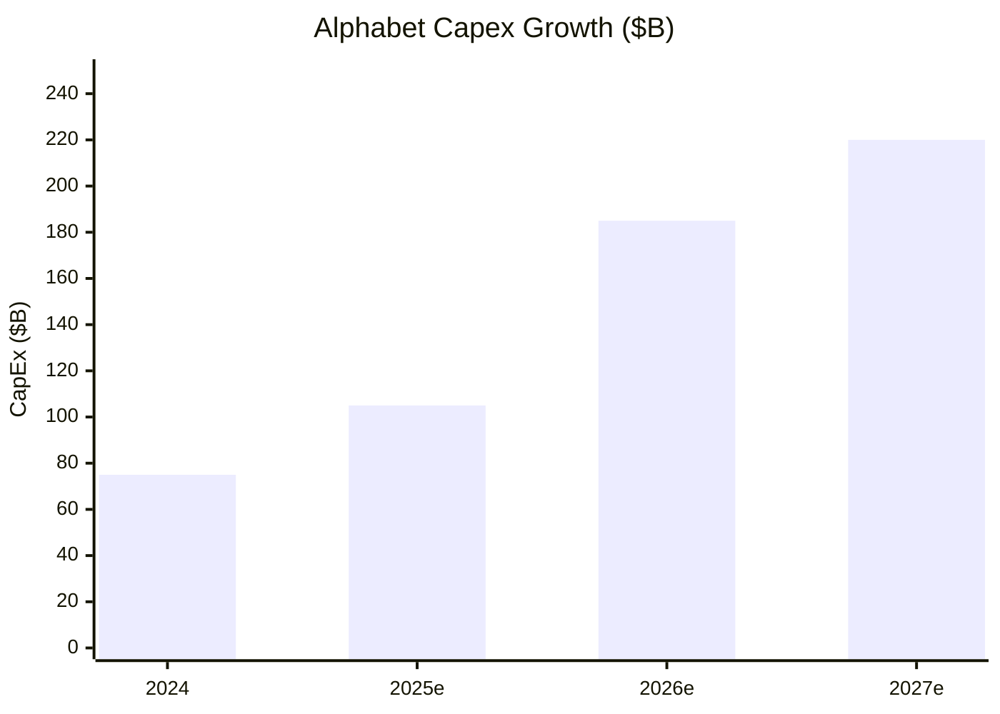

# Ecosystem — 2026-06-05

## Alphabet Raises $84.75B in Equity for AI Infrastructure 

**Source:** [Bloomberg](https://www.bloomberg.com/news/articles/2026-06-01/alphabet-to-raise-80-billion-in-equity-capital-for-ai-spending) · [Alphabet IR](https://abc.xyz/investor/news/news-details/2026/Alphabet-Announces-Proposed-80-Billion-Equity-Capital-Raise-to-Expand-AI-Infrastructure-and-Compute-2026-b0myAMewCa/default.aspx) · **Type:** funding · **Time (UTC):** Jun 1

Alphabet announced a three-part equity offering totaling $80B on June 1, upsized to $84.75B at close: a $40B at-the-market program beginning Q3, a $30B underwritten offering of shares and mandatory convertible preferred stock, and a $10B private placement with Berkshire Hathaway. The stated purpose is AI compute infrastructure to meet what Alphabet describes as unprecedented customer demand. On its Q1 2026 earnings call Alphabet projected 2026 capital expenditures of $180–190B — up from $75B in 2024 — and signaled that 2027 capex would increase again. This is the largest equity raise by a publicly traded AI company, and its scale in part explains the Vera Rubin NVL72 production ramp announced simultaneously at Computex.

**Why it matters:** At $84.75B in new equity plus $180–190B in capex, Alphabet is committing roughly the entire market cap of a mid-large S&P 500 company to AI infrastructure in a single fiscal year; the Berkshire anchor signals mainstream institutional conviction in compute as a durable growth asset, not a cycle.

---

## Colorado AI Act Overhauled: Duty of Care Dropped, Effective Date Pushed to Jan 2027 

**Source:** [Seyfarth Shaw](https://www.seyfarth.com/news-insights/artificial-intelligence-legal-roundup-colorado-postpones-implementation-of-colorado-ai-act-sb-24-205.html) · [Law and the Workplace](https://www.lawandtheworkplace.com/2026/04/colorado-takes-a-major-step-towards-rewriting-its-ai-law-as-its-effective-date-approaches/) · **Type:** regulation · **Time (UTC):** May 14 (signed)

Colorado Governor Jared Polis signed SB 189 on May 14, replacing the original Colorado AI Act (SB 24-205) with a substantially narrower law effective January 1, 2027. The original law — the first US state comprehensive AI regulation, previously delayed twice from February 2026 to June 30, 2026 — imposed a duty of care to prevent algorithmic discrimination, required deployers to maintain risk-management programs and conduct impact assessments, and mandated reporting to the Colorado AG. SB 189 eliminates all of those obligations, replacing them with limited disclosures and transparency requirements around "automated decision-making technologies" (ADMT). The new law narrows in scope to specific ADMT use cases rather than high-risk AI systems broadly defined.

**Why it matters:** Colorado's original law was the template the AI governance community expected other states and the EU to benchmark against; its gutting — despite being the strictest US state AI bill — signals that sector-specific transparency mandates are the politically viable ceiling for US state AI regulation in this cycle, significantly below the EU AI Act's risk-based framework.

---
