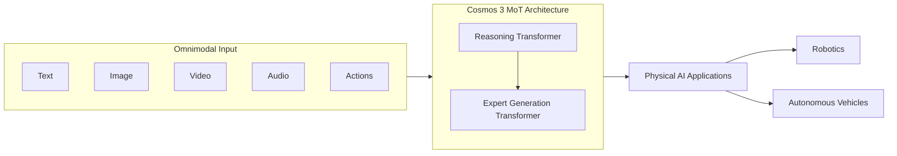

# Models — 2026-06-05

## NVIDIA Cosmos 3 

**Source:** [NVIDIA Newsroom](https://nvidianews.nvidia.com/news/nvidia-launches-cosmos-3-the-open-frontier-foundation-model-for-physical-ai) · **Type:** release · **Time (UTC):** Jun 1, ~14:00

NVIDIA launched Cosmos 3, an open world foundation model for physical AI trained on 20 trillion tokens of multimodal data — roughly 1 billion images, 400 million real and synthetic videos, ambient audio, text, and action trajectories from humans and robots. Unlike video generators focused on visual plausibility, Cosmos 3 models object interactions and spatial-temporal dynamics to support training robots and autonomous vehicles. It uses a two-tower Mixture-of-Transformers pairing a reasoning transformer with an expert generation transformer. Three variants ship: Cosmos 3 Super (highest physics accuracy), Cosmos 3 Nano (fractions-of-a-second inference), and Cosmos 3 Edge (coming soon, real-time edge deployment). Weights are available on Hugging Face, GitHub, and as NIM microservices via build.nvidia.com. Initial partners include Agile Robots, Black Forest Labs, and Runway.

**Why it matters:** The only prior open physical-AI world model with action prediction was NVIDIA's own Cosmos 1; Cosmos 3 adds omnimodal input/output and a coalition structure analogous to how Llama attracted ecosystem tooling — making it the new default baseline for robot sim-to-real transfer and synthetic data pipelines.

| Benchmark | Cosmos 3 Rank |
|---|---|
| Physics-IQ (generation accuracy) | #1 open model |
| PAI-Bench | #1 open model |
| RoboLab (action policy) | #1 open model |
| RoboArena | #1 open model |
| VANTAGE-Bench (vision understanding) | #1 open model |

---

## NVIDIA Nemotron 3 Ultra weights on Hugging Face 

**Source:** [NVIDIA Newsroom](https://nvidianews.nvidia.com/news/nvidia-debuts-nemotron-3-family-of-open-models) · **Type:** release · **Time (UTC):** Jun 4, ~08:00

NVIDIA released the BF16 and NVFP4 open weights for Nemotron 3 Ultra (550B total / 55B active, Mamba-2+Transformer MoE) on Hugging Face, OpenRouter, ModelScope, and as NIM microservices on June 4. The Computex announcement on June 1 described the model and benchmarks; the June 4 weight release is what makes it deployable. The model claims the top slot on the US open-weight intelligence index (score 48), producing 300+ tok/s on a single DGX node and 1M-token context at NVFP4 precision. Retrieval, coding, and instruction-following were cited as the primary target workloads.

**Why it matters:** The weight release moves Nemotron 3 Ultra from a paper benchmark to a model engineers can actually fine-tune or deploy; at 55B active parameters it is meaningfully cheaper to serve than dense 70B+ alternatives with comparable benchmark scores.

---

## Holo3.1 Computer-Use Agent Family 

**Source:** [Hugging Face Blog](https://huggingface.co/blog/Hcompany/holo31) · **Type:** release · **Time (UTC):** Jun 2, ~12:00

H Company released Holo3.1, a family of four computer-use agent models (0.8B, 4B, 9B, 35B-A3B) designed for desktop, mobile, and web automation. The 35B model reaches 79.3% on AndroidWorld, up from 67% in Holo3 — a 12-point gain. Cross-harness evaluation shows more than 25% improvement over Holo3 in the Holotab product environment. Quantized checkpoints (FP8, Q4 GGUF, NVFP4) are provided; NVFP4 delivers 1.74× the token throughput of BF16 on DGX Spark. Weights are open on Hugging Face.

**Why it matters:** The 0.8B and 4B variants put production-grade computer-use automation within reach of edge hardware; the improvement on AndroidWorld specifically closes the gap on mobile agent tasks where previous open models lagged proprietary systems.

| Variant | AndroidWorld |
|---|---|
| Holo3 35B | 67.0% |
| Holo3.1 35B-A3B | 79.3% |

---
