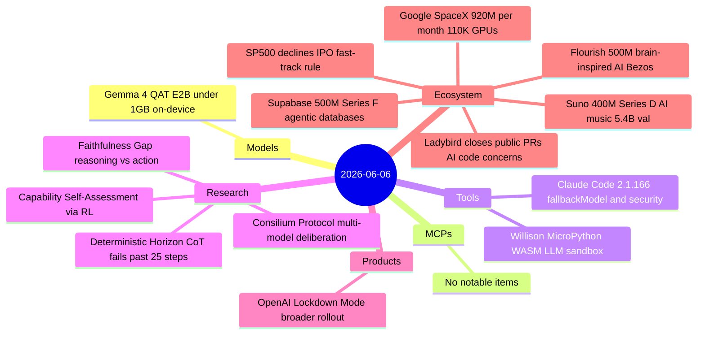
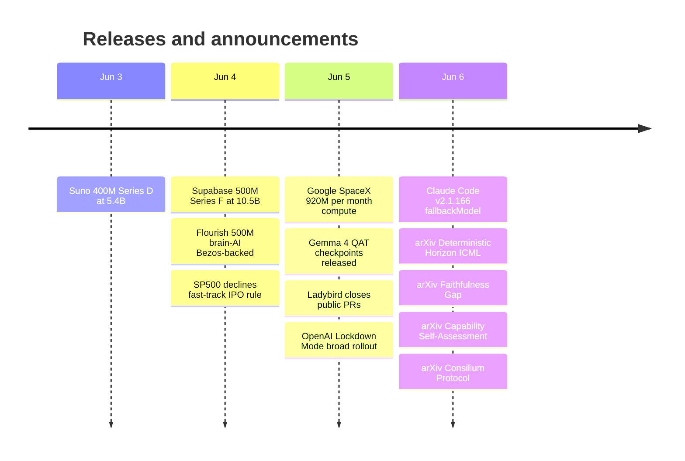

# AI Digest — 2026-06-06

> A funding-heavy day bookended by two infrastructure signals: Google signed a $920M/month compute deal with SpaceX for 110,000 GPUs, and Supabase closed a $500M Series F with the data point that Claude Code is now its single largest source of new database deployments — a concrete measure of how agentic coding tools are reshaping infrastructure provisioning. On the research front, an ICML 2026 paper (arXiv 2606.00376) quantifies a "Deterministic Horizon" at ~19–31 reasoning steps beyond which decoder-only chain-of-thought architecturally cannot track state, putting a formal bound on when tool delegation is not optional. Ecosystem news includes Ladybird closing its public PR queue over AI code-quality concerns — the most prominent open-source project to do so explicitly — and S&P 500 declining to fast-track profitability rules for SpaceX, OpenAI, and Anthropic IPOs.

## Day at a glance

## Top stories

1. **Google pays SpaceX $920M/month for 110,000 GPUs** — The deal (Oct 2026–Jun 2029) is roughly half the capacity Anthropic secured from SpaceX in May, confirming hyperscalers are exhausting internal capacity and paying external premiums; it arrives one week before SpaceX's anticipated ~$1.75T IPO. [→ details](ecosystem.md#google-spacex-compute)
2. **Supabase $500M Series F: Claude Code is its #1 database deployer** — Agentic coding agents now provision the majority of new Supabase databases, with 600% YoY growth; Claude Code is named the single largest contributor in 2026, a striking quantification of agent-driven infrastructure demand. [→ details](ecosystem.md#supabase-series-f)
3. **"Deterministic Horizon" (ICML 2026): pure CoT fails at ~25 steps, tools achieve 86–94%** — An Attention Bottleneck Theorem proves this is an architectural limit, not a training gap; fine-tuning on optimal traces improves accuracy by under 5%, while tool-integrated agents hit 86–94% on the same tasks. [→ details](research.md#deterministic-horizon)

## By the numbers

| Category   | Items | Highlight |
|------------|------:|-----------|
| Models     |     1 | Gemma 4 E2B < 1 GB via QAT mobile format |
| MCPs       |     0 | — |
| Tools      |     2 | Claude Code 2.1.166: fallbackModel + session security |
| Research   |     4 | Deterministic Horizon: CoT ceiling ~25 steps; tool agents 86–94% |
| Products   |     1 | OpenAI Lockdown Mode: broad rollout, disables Agent Mode |
| Ecosystem  |     6 | Google-SpaceX $920M/mo; Supabase $500M; S&P 500 IPO rules stand |

## Timeline (UTC)

## Files
- [Models](models.md)
- [MCPs](mcps.md)
- [Tools](tools.md)
- [Research](research.md)
- [Products](products.md)
- [Ecosystem](ecosystem.md)
