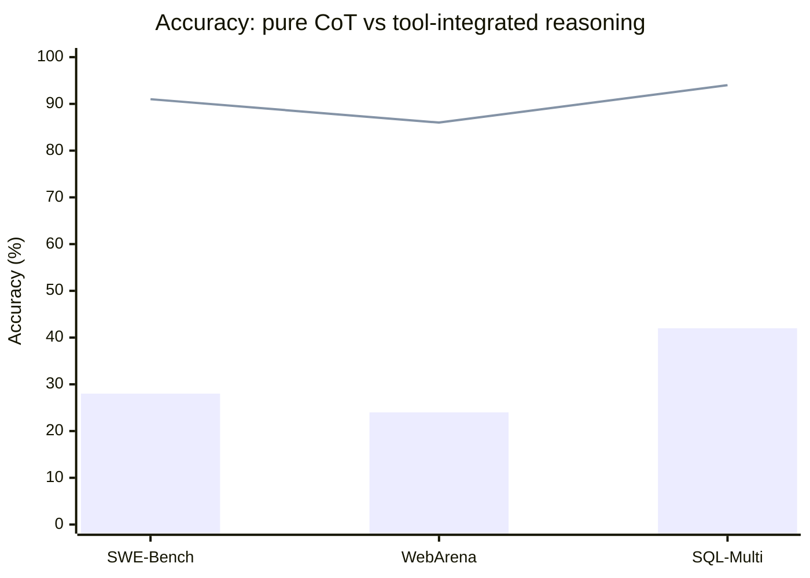

# Research — 2026-06-06

## The Deterministic Horizon: when extended CoT fails and tools become necessary 

**Source:** [arXiv 2606.00376](https://arxiv.org/abs/2606.00376) · **Type:** paper (ICML 2026 accepted) · **Time (UTC):** —

The paper proves an Attention Bottleneck Theorem bounding state-tracking capacity at O(H·log(L/H)·√d_h) for decoder-only attention, then derives a "Deterministic Horizon" of approximately 19–31 steps beyond which pure chain-of-thought reasoning becomes infeasible on deterministic state-tracking tasks. The failure mode is architectural — not a training deficiency — confirmed by cross-model correlation of 0.81–0.91 and a finding that fine-tuning on optimal traces improves accuracy by less than 5%. Testing across 12 models and 8 task domains (including SWE-Bench, WebArena, SQL-Multi) shows tool-integrated reasoning achieves 86–94% accuracy versus 24–42% for pure neural chain-of-thought.

**Why it matters:** Provides a principled, quantified answer to when hybrid tool-augmented agents should replace pure reasoning agents — and frames the boundary as an architectural constant, not a prompt-engineering problem. Directly relevant to anyone designing multi-step agentic systems.

---

## Doing What They Say, Not What They Reason: Locating the Faithfulness Gap 

**Source:** [arXiv 2606.00476](https://arxiv.org/abs/2606.00476) · **Type:** paper · **Time (UTC):** —

Using a Texas Poker simulator (where correct actions are objectively verifiable), the authors decompose agent reliability into two components: whether conclusions match reasoning, and whether actions match conclusions. They find these two steps "behave oppositely" — the reasoning-to-conclusion step and the conclusion-to-action step show inconsistent fidelity in opposite directions, revealing a systematic faithfulness gap that is invisible in end-to-end accuracy metrics.

**Why it matters:** Separating reasoning fidelity from execution fidelity gives developers a targeted diagnostic for agent failures: a model may reason correctly but execute inconsistently (or vice versa), requiring different interventions. Relevant for safety and reliability evaluation of agentic deployments.

---

## Capability Self-Assessment: teaching LLMs to know their limits via RL 

**Source:** [arXiv 2606.00251](https://arxiv.org/abs/2606.00251) · **Type:** paper · **Time (UTC):** —

The paper frames Capability Self-Assessment (CSA) as a policy-learning problem and shows that reinforcement learning significantly outperforms supervised fine-tuning at teaching models to recognize when they cannot reliably solve a problem. Critically, learned CSA generalizes beyond the training distribution, behaving as a transferable capability rather than memorized task labels. Practical applications include local-vs-cloud routing decisions during inference and targeted data selection for training pipelines.

**Why it matters:** Models that overestimate their own competence are a known failure mode in production deployments. RL-based CSA offers a practical path to models that abstain appropriately — and the generalization finding suggests the skill transfers across domains, not just the training benchmark.

---

## Emergent Collaborative Deliberation in Multi-Model AI Systems: the Consilium Protocol 

**Source:** [arXiv 2606.00005](https://arxiv.org/abs/2606.00005) · **Type:** paper · **Time (UTC):** —

The Consilium Protocol applies Byzantine Fault Tolerance principles to multi-model deliberation across 1,478 sessions spanning 32 topics in 10 domains. The central finding is that assigned cognitive personas — not model tier — primarily determine epistemic quality: cheaper models with engineered reasoning personas matched frontier models' analytical quality at 99.98% lower cost ($217 total experimental budget). RLHF alignment introduces measurable directional bias in contested policy domains (12.3 percentage points less adversarial challenge versus settled-science topics), while the protocol itself showed only ±1–2% directional bias.

**Why it matters:** For anyone building multi-agent deliberation pipelines, this suggests persona engineering is a higher-leverage variable than model selection. The RLHF alignment bias finding also has implications for using LLM judges in politically or ethically contested domains.

---
