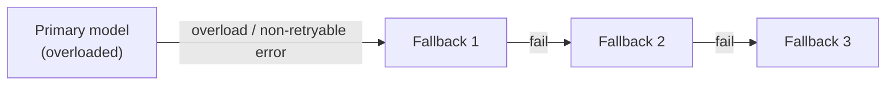

# Tools — 2026-06-06

## Claude Code v2.1.166: fallbackModel and cross-session security hardening 

**Source:** [GitHub releases](https://github.com/anthropics/claude-code/releases) · **Type:** release · **Time (UTC):** 00:55

Claude Code v2.1.166 ships two operationally important features alongside a security fix. The new `fallbackModel` setting accepts an ordered list of up to three models that Claude Code will try in sequence whenever the primary model is overloaded or returns unexpected non-retryable errors; `--fallback-model` now applies to interactive sessions as well. Cross-session message security is hardened: messages relayed via `SendMessage` from other Claude sessions are no longer granted user-level authority, closing a privilege-escalation vector in multi-agent workflows. Thinking can be disabled unconditionally via `MAX_THINKING_TOKENS=0`, `--thinking disabled`, or per-model toggles. Bug fixes address JetBrains terminal flickering on 2026.1+, Shift+non-ASCII drops in Kitty-protocol terminals (WezTerm, Ghostty), PowerShell validation hangs on Windows, and spurious "image could not be processed" errors. A follow-on v2.1.167 (01:33 UTC) added further reliability fixes.

**Why it matters:** The fallback model feature makes unattended long-running agent runs more resilient to capacity spikes without manual intervention. The cross-session message authority change is a meaningful security boundary for anyone running orchestrator/subagent topologies with Claude Code.

---

## Simon Willison: MicroPython WASM sandbox for LLM code execution 

**Source:** [simonwillison.net](https://simonwillison.net/2026/Jun/6/running-python-code-in-a-sandbox-with-micropython-and-wasm/) · **Type:** release · **Time (UTC):** 03:53

Simon Willison published an approach and accompanying `micropython-wasm 0.1a2` library for executing LLM-generated Python inside a MicroPython + WebAssembly sandbox. The implementation hooks into Datasette Agent via a `datasette-agent-micropython` plugin. The sandbox prevents LLM-generated code from escaping to the host Python runtime, addressing one of the standard risks in agent tool-use loops (arbitrary code execution on the host).

**Why it matters:** Practical, low-dependency Python sandboxing for LLM agents has lacked a clean approach; MicroPython + WASM provides near-zero-overhead isolation without container overhead or a remote execution service. Relevant to anyone building agents that execute generated code locally.

---
