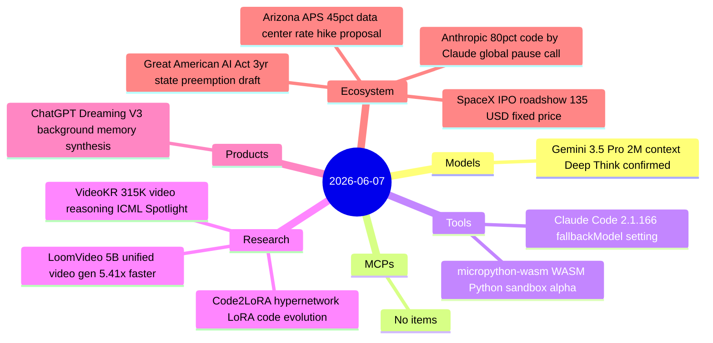
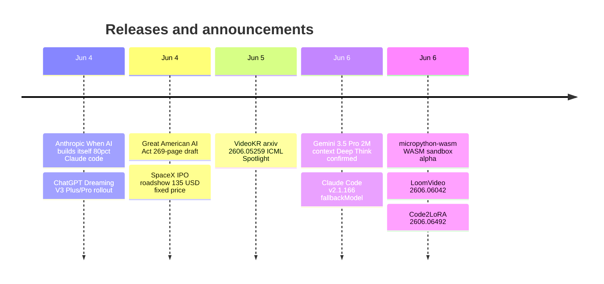

# AI Digest — 2026-06-07

> A 48-hour lookback window (no June 6 digest was published) yields 11 items across five active categories. The defining story is Anthropic's "When AI builds itself" post — the first frontier lab to publish internal AI-code-authorship metrics at this scale, confirming 80% of production code is now Claude-authored and calling for a verifiable multi-party pause mechanism before recursive self-improvement exits the theoretical. ChatGPT Dreaming V3, missed by the June 5 digest, landed on June 4; and on the policy front, a bipartisan 269-page "Great American AI Act" discussion draft proposed three years of federal preemption of state AI laws and drew near-universal opposition from labor and consumer groups within hours of release.

## Day at a glance

## Top stories

1. **Anthropic: Claude now writes 80% of production code — calls for global pause mechanism** — The first frontier lab to publish real internal AI-code-authorship metrics at this scale, alongside a concrete policy argument that the world needs a verifiable cross-lab pause before recursive self-improvement becomes self-directed. [→ details](ecosystem.md#anthropic-80pct-code)
2. **Great American AI Act: bipartisan draft proposes three-year federal preemption of state AI laws** — The 269-page discussion draft would freeze state AI development regulations, mandate semi-annual third-party audits for frontier labs with $500M+ revenue, and require 15-day safety incident reporting. [→ details](ecosystem.md#great-american-ai-act)
3. **ChatGPT Dreaming V3: background memory synthesis reaches Plus and Pro** — OpenAI's most significant memory architecture overhaul, rolling out since June 4, synthesizes conversation history in a background process, claims 5× compute reduction, and auto-updates memories as circumstances change. [→ details](products.md#chatgpt-dreaming-v3)

## By the numbers

| Category   | Items | Highlight |
|------------|------:|-----------|
| Models     |     1 | Gemini 3.5 Pro: 2M context, Deep Think mode, ~$15/$60 per 1M tokens, launch pending |
| MCPs       |     0 | — |
| Tools      |     2 | Claude Code 2.1.166: fallbackModel chains; micropython-wasm: WASM Python sandbox |
| Research   |     3 | LoomVideo: 5.41× inference speedup; VideoKR: ICML Spotlight |
| Products   |     1 | ChatGPT Dreaming V3: 5× compute reduction, self-updating memory |
| Ecosystem  |     4 | Anthropic 80% Claude code + pause call; Great American AI Act; SpaceX IPO roadshow |

## Timeline (UTC)

## Files
- [Models](models.md)
- [MCPs](mcps.md)
- [Tools](tools.md)
- [Research](research.md)
- [Products](products.md)
- [Ecosystem](ecosystem.md)
