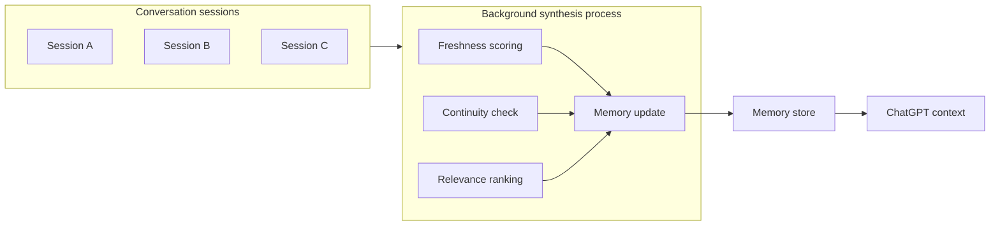

# Products — 2026-06-07

## ChatGPT Dreaming V3: background memory synthesis 

**Source:** [OpenAI](https://openai.com/index/chatgpt-memory-dreaming/) · [TechTimes](https://www.techtimes.com/articles/317840/20260605/chatgpt-memory-dreaming-update-openai-rewrites-personalization-engine-limits-audit-trail.htm) · **Type:** launch · **Time (UTC):** Jun 4, ~14:00

OpenAI launched Dreaming V3 on June 4, the largest overhaul of ChatGPT's memory system to date. The previous architecture required users to manually save memories or relied on explicit `remember this` prompts; Dreaming V3 runs a single asynchronous background process that synthesizes memory from conversation history across three dimensions — freshness, continuity, and relevance — without user intervention. Memory entries auto-update as circumstances change (e.g., "going to Singapore in July" transitions to "went to Singapore in July" after the trip). OpenAI claims a 5× reduction in compute required for memory synthesis compared to the prior architecture, enabling free-tier access alongside Plus and Pro. A reviewable memory summary page and granular edit/delete controls are included; temporary chats remain unsaved.

**Why it matters:** For engineers building on ChatGPT's API or Enterprise tier, Dreaming V3 marks the shift from explicit to implicit user state management — a meaningful UX change for long-running agentic workflows and copilot applications where retaining context across sessions reduces user friction significantly.

---
