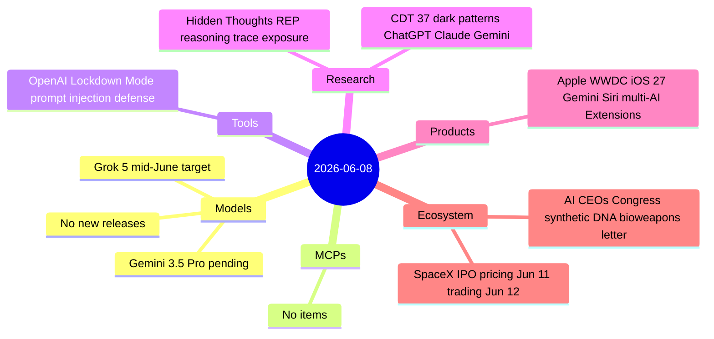

# AI Digest — 2026-06-08

> Apple WWDC 2026 is the day's defining story: Tim Cook's final keynote officially brings Gemini-powered Siri (custom 1.2T-param model, $1B/year Google deal running on Apple's own Private Cloud Compute) to iOS 27, along with a multi-AI Extensions system that makes Claude and ChatGPT native iPhone AI options for the first time. Two items missed by last week's digests complete the picture: AI lab CEOs from OpenAI, Anthropic, Google DeepMind, and Microsoft jointly asked Congress to mandate synthetic DNA screening (June 4–5), and OpenAI launched Lockdown Mode to close the network-egress exfiltration pathway in prompt injection attacks (June 5–6). Research brings a finding that interface-level reasoning suppression is insufficient — users can recover hidden chain-of-thought via "Reasoning Exposure Prompting" — and the CDT published the most systematic audit of AI chatbot dark patterns to date, cataloguing 37 manipulative design patterns across ChatGPT, Claude, and Gemini.

## Day at a glance



## Top stories

1. **Apple WWDC 2026: Gemini-powered Siri and Claude on iPhone** — Tim Cook's final keynote rebuilds Siri on a custom 1.2T-param Gemini model ($1B/year Google deal on Apple PCC) and adds iOS 27 multi-AI Extensions that let users route queries to Claude, ChatGPT, or Gemini natively. [→ details](products.md#apple-wwdc-2026)
2. **AI lab CEOs jointly ask Congress to mandate synthetic DNA screening** — Amodei, Altman, Hassabis, and Suleyman co-signed the first cross-lab joint regulatory request, asking Congress to legally require genetic material vendors to screen for bioweapon-relevant orders as AI erodes synthesis barriers. [→ details](ecosystem.md#ai-ceos-biosecurity-letter)
3. **OpenAI Lockdown Mode: network egress blocked for prompt injection defense** — An optional ChatGPT setting that disables web access, image loading, deep research, and agent mode to prevent attackers from exfiltrating data after a successful prompt injection. Rolling out to all personal and self-serve Business tiers. [→ details](tools.md#openai-lockdown-mode)

## By the numbers

| Category   | Items | Highlight |
|------------|------:|-----------|
| Models     |     0 | Gemini 3.5 Pro and Grok 5 still pending GA |
| MCPs       |     0 | — |
| Tools      |     1 | OpenAI Lockdown Mode: first egress-blocking prompt injection defense |
| Research   |     2 | REP attack recovers hidden CoT; CDT maps 37 AI chatbot dark patterns |
| Products   |     1 | Apple WWDC: Gemini-powered Siri, Claude on iPhone via Extensions |
| Ecosystem  |     2 | AI CEOs biosecurity letter to Congress; SpaceX IPO June 11–12 |

## Timeline (UTC)

```mermaid
timeline
  title Releases and announcements
  May 28 : CDT Dark Patterns in AI Chatbots report published
  Jun 04 : AI CEOs joint biosecurity letter to Congress
  Jun 05 : OpenAI Lockdown Mode begins rollout
  Jun 08 17:00 : Apple WWDC keynote - Gemini Siri - iOS 27 multi-AI Extensions
  Jun 11 : SpaceX SPCX IPO pricing
  Jun 12 : SpaceX SPCX trading opens
```

## Files
- [Models](models.md)
- [MCPs](mcps.md)
- [Tools](tools.md)
- [Research](research.md)
- [Products](products.md)
- [Ecosystem](ecosystem.md)
