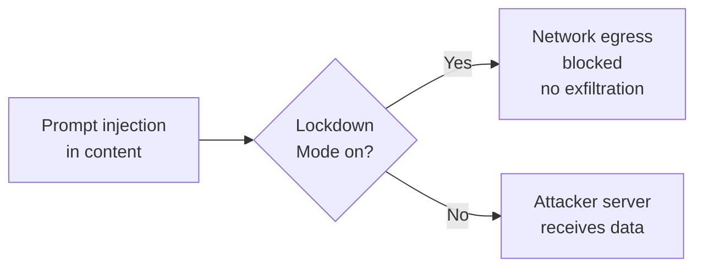

# Tools — 2026-06-08

## OpenAI Lockdown Mode 

**Source:** [TechCrunch](https://techcrunch.com/2026/06/06/openai-unveils-lockdown-mode-to-protect-sensitive-data-from-prompt-injection-attacks/) · [OpenAI via Simon Willison](https://simonwillison.net/2026/Jun/5/openai-help-lockdown-mode/) · **Type:** release · **Time (UTC):** Jun 5–6

OpenAI rolled out an optional security setting called Lockdown Mode across all personal ChatGPT tiers (Free, Go, Plus, Pro) and self-serve Business accounts. When enabled, it disables live web browsing (read-only cached access only), remote image loading, deep research, and agent mode — the four channels attackers most commonly exploit to exfiltrate sensitive data after a successful prompt injection. The setting does not block prompt injections from appearing in content ChatGPT processes; it only closes the outbound exfiltration pathway once an attack occurs. Users toggle it in Settings → Safety and security → Advanced security.

**Why it matters:** Prompt injection attacks that steal account data through model tool calls are a growing threat class in agentic deployments. Lockdown Mode is the first first-party, user-facing defense against exfiltration in any major AI chat product. It validates the threat model Anthropic demonstrated in its June 4 containment post (24/25 phishing-injected credential exfiltrations) while offering a practical mitigation even for non-enterprise users handling sensitive material.

---
