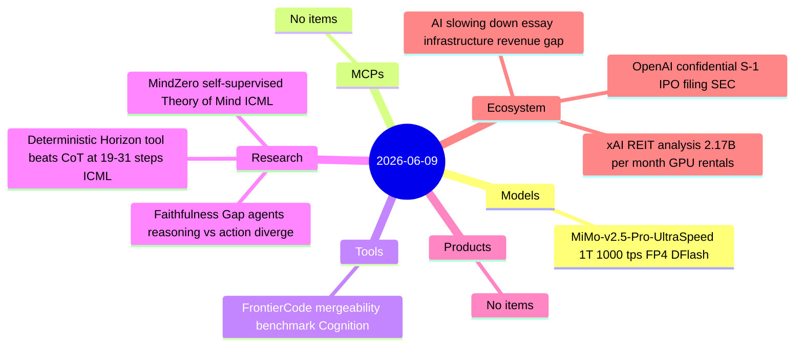
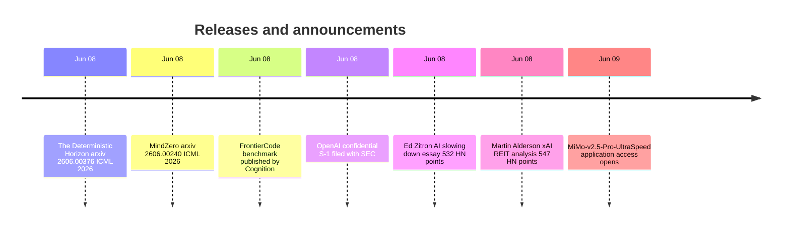

# AI Digest — 2026-06-09

> Today's technical headline is MiMo-v2.5-Pro-UltraSpeed — Xiaomi's 1-trillion-parameter model that for the first time sustains 1,000+ tokens/second on a single 8-GPU commodity node, via selective FP4 quantization and DFlash speculative decoding. OpenAI filed a confidential S-1 with the SEC on June 8, following Anthropic's June 1 filing and setting up a dual public-market race; the last valuation was $852B with Goldman and Morgan Stanley leading, but no IPO date is set. Two widely-shared essays frame an economic counternarrative: Martin Alderson's data showing xAI earns $2.17B/month renting GPUs to Anthropic and Google (making it look more like a datacenter REIT), and Ed Zitron's argument that the entire industry faces a structural gap between $9.5–15T in planned infrastructure and the revenue base needed to close it.

## Day at a glance

## Top stories

1. **MiMo-v2.5-Pro-UltraSpeed: 1T model sustains 1,000+ tokens/sec** — Xiaomi and TileRT break a practical latency threshold for trillion-parameter models using FP4 expert quantization and block-parallel DFlash decoding; application access opened June 9. [→ details](models.md#mimo-ultraspeed)
2. **OpenAI files confidential S-1 with SEC** — Goldman Sachs and Morgan Stanley are leading; last valuation $852B; no IPO date set. Anthropic filed 8 days earlier, now reportedly at ~$1T on secondary markets. [→ details](ecosystem.md#openai-ipo-s1)
3. **The Deterministic Horizon: neural CoT fails past 19–31 steps** — ICML 2026 paper establishes an Attention Bottleneck Theorem and finds tool-integrated reasoning reaches 86–94% accuracy vs 24–42% for CoT alone on deterministic state-tracking tasks, with 0.81–0.91 cross-model correlation. [→ details](research.md#deterministic-horizon)

## By the numbers

| Category   | Items | Highlight |
|------------|------:|-----------|
| Models     |     1 | MiMo-v2.5-Pro-UltraSpeed: first 1T model at 1,000+ tokens/sec |
| MCPs       |     0 | — |
| Tools      |     1 | FrontierCode: Opus 4.8 13.4% on Diamond tier, best of tested models |
| Research   |     3 | Deterministic Horizon: tool delegation threshold proven at 19–31 steps |
| Products   |     0 | — |
| Ecosystem  |     3 | OpenAI S-1 filed; xAI REIT analysis; AI infrastructure revenue gap essay |

## Timeline (UTC)

## Files
- [Models](models.md)
- [MCPs](mcps.md)
- [Tools](tools.md)
- [Research](research.md)
- [Products](products.md)
- [Ecosystem](ecosystem.md)
