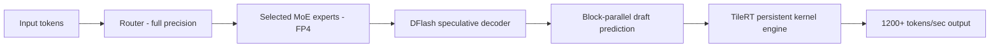

# Models — 2026-06-09

## MiMo-v2.5-Pro-UltraSpeed: 1T-param model breaks 1,000 tokens/second 

**Source:** [Xiaomi MiMo Blog](https://mimo.xiaomi.com/blog/mimo-tilert-1000tps) · **Type:** release · **Time (UTC):** Jun 09

Xiaomi and inference startup TileRT jointly launched MiMo-v2.5-Pro-UltraSpeed, a 1-trillion-parameter mixture-of-experts variant that sustains over 1,200 tokens per second on a single 8-GPU commodity node — the first publicly claimed crossing of the 1,000 tokens/second threshold for a 1T model. Two engineering choices drive the speedup: selective FP4 quantization applied only to MoE expert weights (preserving precision in attention and routing layers), and DFlash, a speculative decoding method that drafts in parallel blocks rather than sequentially, enabling microsecond-level execution via persistent kernel engines and warp specialization in TileRT's inference stack. Pricing is 3× the standard MiMo-v2.5-Pro rate, which the companies argue delivers roughly 10× the generation throughput.

**Why it matters:** Sub-second latency at 1T-parameter scale changes the unit economics of long-context agentic workloads — tasks that were previously throttled by time rather than cost. The application-based access window (June 9–23) will let enterprise teams measure real-world latency before broader availability.

| Metric | Value |
|---|---|
| Peak decode speed | ~1,200 tokens/sec |
| Hardware | 1 × 8-GPU node (commodity) |
| Context window | 1M tokens |
| Quantization | FP4 (MoE experts only) |
| Access model | Application-based (Jun 9–23) |
| Price vs standard | 3× |

---
