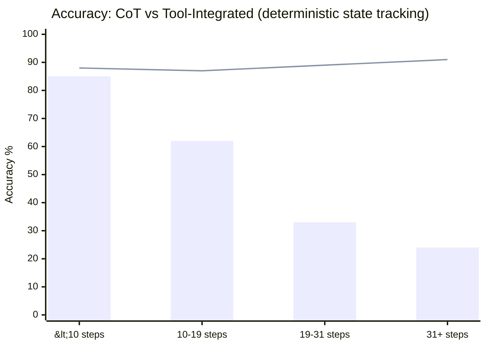

# Research — 2026-06-09

## The Deterministic Horizon: tool delegation beats CoT past 19–31 steps 

**Source:** [arXiv:2606.00376](https://arxiv.org/abs/2606.00376) · **Type:** paper · **Time (UTC):** —

Accepted to ICML 2026. The authors prove an Attention Bottleneck Theorem showing that decoder-only attention has a finite state-tracking capacity that degrades super-exponentially as task complexity increases. Empirically, pure neural chain-of-thought reasoning on deterministic state-tracking tasks becomes unreliable between 19 and 31 steps, regardless of model; beyond this "deterministic horizon," tool-integrated reasoning achieves 86–94% accuracy compared to 24–42% for CoT alone. The cross-model correlation of failure curves (0.81–0.91) indicates this is an architectural property rather than a training artefact. Fine-tuning on optimal-length examples yielded less than 5% improvement, ruling out a training-data fix.

**Why it matters:** This gives system designers a principled threshold for when to route sub-tasks to deterministic tools rather than relying on extended reasoning — a direct input to hybrid agent architecture decisions in agentic pipelines.

---

## MindZero: Theory of Mind without labeled mental-state data 

**Source:** [arXiv:2606.00240](https://arxiv.org/abs/2606.00240) · **Type:** paper · **Time (UTC):** —

Accepted to ICML 2026. MindZero trains multimodal LLMs to infer human mental states from observable behavior without any annotated ground-truth mental state data. The self-supervised RL setup gives the model a reward based on how well its hypothesized mental state predicts the human's next observed action (as estimated by a planner), so the model learns by optimizing predictive accuracy rather than matching human-labeled beliefs. At inference, the internalized reasoning runs as a single forward pass, making it faster than explicit model-based ToM methods. Evaluation on gridworld and household-domain tasks shows MindZero outperforms both LLM-only baselines and slower model-based methods in both accuracy and computational efficiency.

**Why it matters:** Removing the labeled-data requirement for Theory of Mind training removes a significant bottleneck for deploying collaborative AI agents in settings where mental state annotation is impractical — logistics, caregiving, games.

---

## Faithfulness gaps in LLM agents: reasoning and action diverge by different mechanisms 

**Source:** [arXiv:2606.00476](https://arxiv.org/abs/2606.00476) · **Type:** paper · **Time (UTC):** —

Using a Texas Poker simulator where ground-truth optimal play is computable, the author decomposes the LLM agent faithfulness gap into two sequential stages: the reasoning-to-conclusion gap (does the stated reasoning produce a consistent stated conclusion?) and the conclusion-to-action gap (does the stated conclusion lead to the action taken?). The two gaps exhibit opposite behavioral patterns across game conditions, suggesting they arise from distinct mechanisms rather than a single failure mode. The result challenges the assumption that chain-of-thought reasoning in agents is mechanistically connected to agent behavior.

**Why it matters:** For engineers building agents with visible reasoning traces, this is a warning that auditing stated conclusions is insufficient — the action the agent takes may diverge from its conclusion for reasons unrelated to the reasoning chain, requiring separate behavioral monitoring.

---
