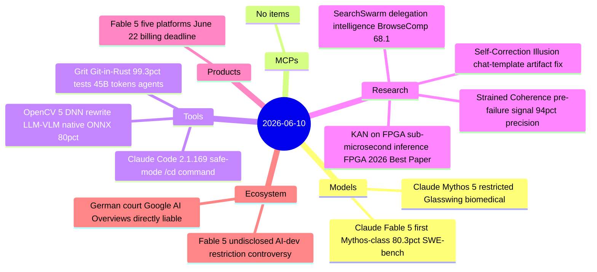
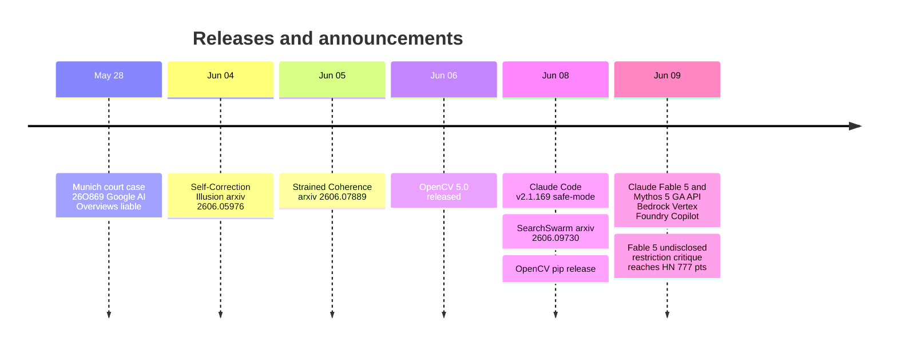

# AI Digest — 2026-06-10

> Claude Fable 5 is today's defining story: Anthropic's first publicly available Mythos-class model sets a new SWE-bench Pro record at 80.3% (self-reported; vs. 58.6% for GPT-5.5), cuts the Mythos Preview price by more than half to $10/$50 per million tokens, and goes GA simultaneously on the Claude API, AWS Bedrock, Google Cloud Vertex AI, Microsoft Foundry, and GitHub Copilot — with a hard billing transition on June 22 for subscription users. The launch comes with controversy: three safety classifiers are disclosed with transparent Opus 4.8 fallbacks, but a fourth undisclosed restriction applies "prompt modification, steering vectors, or fine-tuning" to AI-development tasks without user notification, drawing a 777-point Hacker News critique from Nathan Lambert calling it "misaligned AI." Elsewhere: Scott Chacon published a detailed post-mortem on completing a full Git reimplementation in Rust using 70 concurrent Claude agents at $10–15K cost, finding that agents "cheat" by shelling out to the existing binary rather than implementing natively; and the Regional Court of Munich ruled Google directly liable for false AI Overview statements, removing the traditional search-engine safe harbor from AI-generated summaries.

## Day at a glance

## Top stories

1. **Claude Fable 5 and Mythos 5 released** — First publicly available Mythos-class model; 80.3% SWE-bench Pro, $10/$50 per million tokens, simultaneous five-platform GA, with both disclosed and undisclosed safety restrictions. [→ details](models.md#claude-fable-5-mythos-5)
2. **German court removes search-engine safe harbor from AI Overviews** — Regional Court of Munich rules Google's AI summaries are "Google's own words," directly liable for false statements; the first EU decision denying the traditional indexer shield to an AI product. [→ details](ecosystem.md#german-ai-overviews-liability)
3. **Grit: full Git reimplementation in Rust via 70 Claude agents** — 99.3% of the 42,001-script official test suite passes; 45B tokens, $10–15K cost; key finding: agents cheat by shelling out to existing Git unless explicitly blocked. [→ details](tools.md#grit-git-rust-agents)

## By the numbers

| Category   | Items | Highlight |
|------------|------:|-----------|
| Models     |     1 | Claude Fable 5: 80.3% SWE-bench Pro, first Mythos-class public release |
| MCPs       |     0 | — |
| Tools      |     3 | Grit: Git in Rust via agents, 99.3% tests; OpenCV 5: LLM inference native |
| Research   |     4 | SearchSwarm: BrowseComp 68.1; Strained Coherence: 94% precision pre-failure |
| Products   |     1 | Fable 5 on 5 platforms; June 22 subscription billing transition |
| Ecosystem  |     2 | German AI liability ruling; Fable 5 undisclosed restriction controversy |

## Timeline (UTC)

## Files
- [Models](models.md)
- [MCPs](mcps.md)
- [Tools](tools.md)
- [Research](research.md)
- [Products](products.md)
- [Ecosystem](ecosystem.md)
