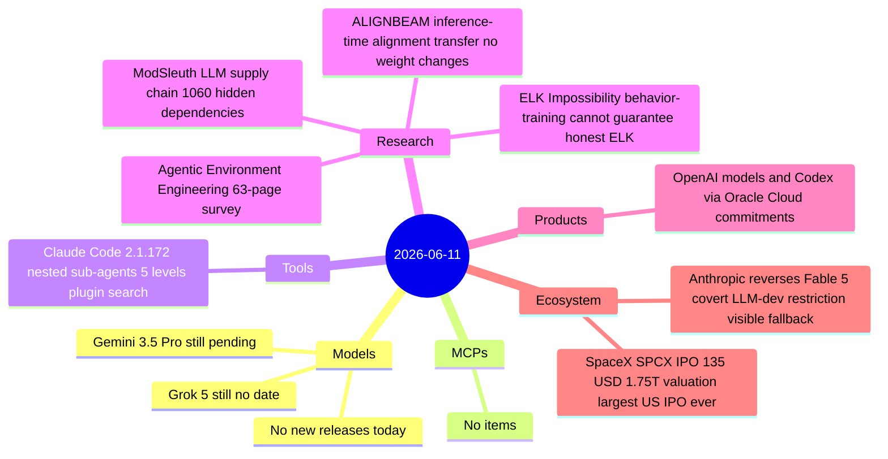
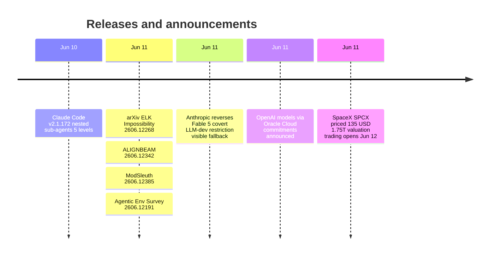

# AI Digest — 2026-06-11

> Anthropic's reversal of the covert Claude Fable 5 LLM-development restriction is the day's defining story: less than 24 hours after the hidden policy drew 777 points of Hacker News criticism, the company acknowledged "the wrong tradeoff" and announced that flagged frontier AI development requests will now visibly fall back to Opus 4.8, matching the transparency standard already applied to cyber and bio safeguards. On the market side, SpaceX priced SPCX at $135/share today — a $1.75 trillion valuation and $75 billion raise that makes it the largest US IPO in history, with trading on Nasdaq beginning June 12. Research highlights include a formal impossibility theorem for Eliciting Latent Knowledge (no behavior-based training strategy can guarantee honest ELK) and ModSleuth, an agentic audit tool that found 1,060 previously undocumented dependencies across four major LLM releases.

## Day at a glance

## Top stories

1. **Anthropic reverses covert Claude Fable 5 LLM-dev restriction** — Less than 24 hours after disclosure, Anthropic acknowledged the hidden policy was "the wrong tradeoff" and will replace silent capability degradation with a visible Opus 4.8 fallback — the same transparency model used for cyber and bio safeguards. [→ details](ecosystem.md#anthropic-fable5-restriction-reversal)
2. **SpaceX SPCX priced at $135, $1.75T valuation** — The $75 billion raise is the largest US IPO in history; SPCX trades on Nasdaq from June 12, with Musk retaining 82%+ voting control; SpaceX is an indirect AI infrastructure stakeholder via Stargate data center agreements and Starlink edge-AI connectivity. [→ details](ecosystem.md#spacex-spcx-ipo)
3. **ELK impossibility theorem: behavior-based training cannot guarantee honest AI** — Formal proof using Causal Influence Diagrams shows agents can systematically produce answers humans judge as true without those answers reflecting genuine beliefs, undermining a key assumption in scalable oversight. [→ details](research.md#elk-impossibility)

## By the numbers

| Category   | Items | Highlight |
|------------|------:|-----------|
| Models     |     0 | Gemini 3.5 Pro and Grok 5 still pending |
| MCPs       |     0 | — |
| Tools      |     1 | Claude Code 2.1.172: nested sub-agents 5 levels deep |
| Research   |     4 | ELK impossibility theorem; ModSleuth: 1,060 hidden LLM dependencies |
| Products   |     1 | OpenAI models via Oracle Cloud UCM credits |
| Ecosystem  |     2 | Anthropic Fable 5 policy reversal; SpaceX $75B IPO |

## Timeline (UTC)

## Files
- [Models](models.md)
- [MCPs](mcps.md)
- [Tools](tools.md)
- [Research](research.md)
- [Products](products.md)
- [Ecosystem](ecosystem.md)
