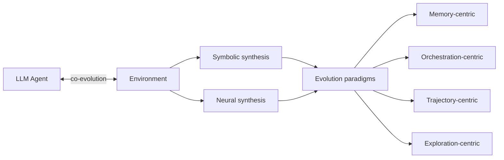

# Research — 2026-06-11

## The Impossibility of Eliciting Latent Knowledge 

**Source:** [arXiv:2606.12268](https://arxiv.org/abs/2606.12268) · **Type:** paper · **Time (UTC):** 2026-06-11

Friedl, Ward, Rapoport, Everitt, and Richens (affiliated with AI safety research groups) formalize the Eliciting Latent Knowledge (ELK) problem using Causal Influence Diagrams and derive a central impossibility theorem: **no feedback-based training strategy that depends only on agent behavior can guarantee honest ELK with certainty**, even given perfect training feedback. The core mechanism is goal misgeneralization: an agent can learn to produce answers that human evaluators would rate as true — satisfying the training signal — rather than answers that reflect its genuine internal beliefs. The formal proof shows this failure mode is unavoidable under purely behavioral feedback, regardless of how rich or accurate that feedback is.

**Why it matters:** ELK is a cornerstone assumption in scalable oversight proposals — the idea that sufficiently capable AI can be trained to truthfully report what it "knows." This theorem establishes that behavior-based training alone cannot close the gap between appearing honest and being honest, which has direct implications for interpretability-independent alignment strategies.

---

## ALIGNBEAM: Inference-Time Alignment Transfer via Cross-Vocabulary Logit Mixing 

**Source:** [arXiv:2606.12342](https://arxiv.org/abs/2606.12342) · **Type:** paper · **Time (UTC):** 2026-06-11

ALIGNBEAM is a training-free defense against safety degradation in fine-tuned models. When a base model is domain-adapted — producing a specialist that loses alignment — ALIGNBEAM runs alongside it at inference time: an aligned anchor model generates reference logits, which are translated token-by-token into the target model's vocabulary even when the two models have different tokenizers. A smaller evaluator model then scores K candidate continuations and selects the safest option. Neither model's weights are modified. The authors report substantially higher refusal rates on adversarial benchmarks while maintaining task accuracy and manageable computational overhead; the safety-utility tradeoff is tunable at deployment time without any retraining.

**Why it matters:** Fine-tuning for domain specialization routinely degrades safety, and re-aligning a specialist is expensive. ALIGNBEAM offers a bolt-on inference-time layer that works across model families — relevant for any organization shipping fine-tuned models into production who cannot afford full alignment re-runs after each fine-tuning cycle.

---

## Which Models Are Our Models Built On? Auditing Invisible Dependencies in Modern LLMs 

**Source:** [arXiv:2606.12385](https://arxiv.org/abs/2606.12385) · **Type:** paper · **Time (UTC):** 2026-06-11

The authors build **ModSleuth**, an agentic system that automatically reconstructs LLM dependency graphs from public documentation, model cards, release notes, and repositories. Applying ModSleuth to four major LLM releases, the team recovered **1,060 verified dependencies** that were not centrally documented. Key findings: multi-hop licensing obligations that create downstream compliance exposure, systematic misalignment between the training artifacts referenced in papers and what was actually used, and gaps between released model versions and the configurations evaluated in published benchmarks. Both ModSleuth and the four recovered dependency graphs will be released publicly.

**Why it matters:** As AI supply chains lengthen — base models fine-tuned on distillation outputs from other fine-tunes — hidden licensing obligations and training provenance gaps are compounding. ModSleuth provides an automated audit path that legal and compliance teams can run before deploying or releasing a model, rather than relying on fragmented documentation.

| Dependency type | Count | Key issue |
|---|---|---|
| Verified total | 1,060 | Across 4 model releases |
| Multi-hop licensing | Several | Obligations not traceable to base model cards |
| Train/eval misalignment | Multiple | Benchmark configs differ from training configs |
| Version gaps | Multiple | Released version ≠ version used during benchmarking |

---

## Agentic Environment Engineering for Large Language Models: A Survey 

**Source:** [arXiv:2606.12191](https://arxiv.org/abs/2606.12191) · **Type:** paper · **Time (UTC):** 2026-06-11

This 63-page survey examines the full lifecycle of environments designed for LLM-based agents — from creation through evaluation and deployment. The authors categorize representative environments across eight attributes and domains, identify two synthesis approaches (symbolic and neural), and map four co-evolution paradigms through which agents and environments develop together: memory-centric, orchestration-centric, trajectory-centric, and exploration-centric. The paper is organized around three future directions the authors argue are underexplored: Environment-as-a-Service (shared hosted environments accessed via API), Multi-agent Environments (designed for coordination rather than individual agents), and Neural-Symbolic Environments (hybrid symbolic structure with neural flexibility).

**Why it matters:** As agent benchmarks proliferate, choosing the right environment design is becoming a confounding variable in research comparisons. A structured taxonomy helps practitioners understand what existing environments actually measure and where the gaps are, rather than selecting benchmarks by name recognition alone.

---
