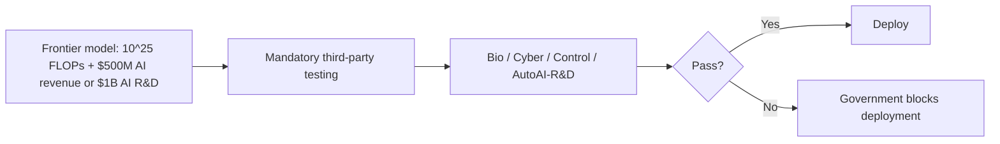

# Ecosystem — 2026-06-12

## SpaceX SPCX Begins Trading on Nasdaq 

**Source:** [Fast Company](https://www.fastcompany.com/91558140/spacex-spcx-stock-price-ipo-trading-start-time-nasdaq-debut) · [TradingKey](https://www.tradingkey.com/analysis/stocks/us-stocks/261960721-spacex-ipo-is-live-at-135-bull-base-and-bear-cases-for-the-first-90-days-tradingkey) · **Type:** IPO · **Time (UTC):** 13:30 (Nasdaq open)

SpaceX (SPCX) began trading on the Nasdaq today at its $135 IPO price — the same fixed price established at the June 11 pricing. At a ~$1.77 trillion fully diluted market cap, this is the largest public offering in US stock market history, raising $75 billion with 555.6 million shares sold. Elon Musk retains over 82% voting control. With only a 4% public float (~$70B market cap tradeable), MSCI announced on June 9 that SPCX qualifies for early large-IPO index inclusion, beginning June 13 — creating structural index-fund demand from the second trading day. Friends-and-family shares (up to $3.75B) are not locked up, adding potential selling pressure on day one.

Wall Street analysts cited at IPO roadshow priced the stock at $60–80 per share — roughly half the offering price — based on standalone DCF of Starlink revenue; the implied premium prices in SpaceX's AI infrastructure relationships (Stargate data center agreements with Oracle, $1.25B/month Colossus compute contract with Anthropic).

*Prior coverage: IPO roadshow opened [2026-06-07](../2026-06-07/ecosystem.md#spacex-ipo-roadshow); pricing confirmed [2026-06-08](../2026-06-08/ecosystem.md#spacex-ipo-pricing); priced June 11 at $135 in [2026-06-11](../2026-06-11/ecosystem.md#spacex-spcx-ipo).*

**Why it matters for AI:** Stargate and Colossus together make SpaceX a tier-1 AI compute stakeholder. A liquid public stock with MSCI eligibility gives SpaceX cheap equity capital for ongoing facility expansion and increases its negotiating leverage with Anthropic and Oracle on future compute agreements.

---

## Anthropic "Policy on the AI Exponential": FAA-style Oversight Proposal + $350M Commitment 

**Source:** [Dario Amodei / Anthropic](https://darioamodei.com/post/policy-on-the-ai-exponential) · [TechTimes](https://www.techtimes.com/articles/318217/20260611/ai-regulation-push-amodei-demands-power-blocking-unsafe-models-anthropic-pledges-350-million.htm) · **Type:** policy · **Time (UTC):** 2026-06-10

Dario Amodei published a two-part policy framework on June 10, 2026. The first part, an **Advanced AI Framework**, calls for mandatory third-party safety testing covering four domains — biological weapons, cybersecurity, loss of control, and automated AI R&D — for any model trained above 10^25 FLOPs by a company earning over $500M in AI revenue or spending over $1B on AI research. The framework explicitly asks for government authority to block deployment when testing reveals unacceptable risk, modeled on FAA airworthiness certification. It also proposes mandatory security standards, red-teaming, and 24-hour incident reporting.

The second part, an **Economic Policy Framework**, maps three US policy response tiers to AI-driven unemployment thresholds: roughly 5%, 10%, and an extreme disruption level. At 5%, the proposal adds wage insurance, workforce training grants, expanded capital accounts (allowing holdings in AI companies), and employer retention incentives. At extreme disruption, it supports universal basic income funded through capital gains or corporate taxation.

Alongside the paper, Anthropic committed $350 million: a **$200 million Economic Futures Research Fund** to establish measurement infrastructure for AI-driven labor displacement, and a **$150 million national fellowship program** (Claude Corps; covered separately in [products.md](products.md#anthropic-claude-corps)).

**Why it matters:** This is the most operationally specific AI safety regulatory ask from any frontier lab CEO to date — compute thresholds, revenue thresholds, four named risk domains, explicit blocking authority — moving beyond aspirational calls for oversight to a workable legislative template. The concurrent $350M financial commitment reduces the "lab says one thing, does another" criticism that has followed previous voluntary safety pledges. The framework directly supports the pending Great American AI Act discussion draft (covered [2026-06-07](../2026-06-07/ecosystem.md#great-american-ai-act)) as an input to its safety testing provisions.

---
