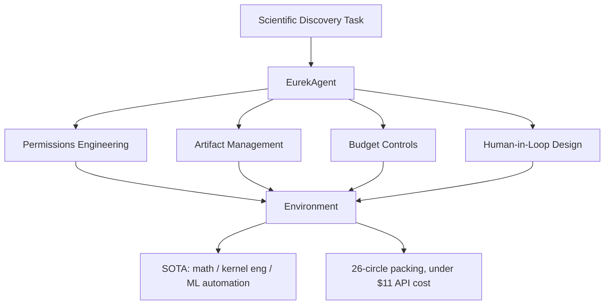

# Research — 2026-06-12

## EurekAgent: Agent Environment Engineering for Autonomous Scientific Discovery 

**Source:** [arXiv:2606.13662](https://arxiv.org/abs/2606.13662) · **Type:** paper · **Time (UTC):** 2026-06-11

Amy Xin, Jiening Siow, Junjie Wang, Zijun Yao, Fanjin Zhang, Jian Song, Lei Hou, and Juanzi Li (Tsinghua) argue that the principal bottleneck for autonomous scientific discovery agents has shifted from prescribing agent workflows to designing agent environments. Their framework, EurekAgent, decomposes environment engineering along four axes: **permissions** (what the agent can read/write/execute), **artifact management** (how intermediate outputs are organized and retrievable), **budget** (computation and API cost guardrails), and **human-in-the-loop** controls (when and how human feedback is injected). Applying the framework to three domains — mathematics, GPU kernel engineering, and machine learning task automation — EurekAgent achieves state-of-the-art results in all three. As a concrete demonstration, the system discovered new 26-circle packing configurations, a known open combinatorial geometry problem, for under $11 in total API cost.

**Why it matters:** The finding repositions agent research: rather than designing better "thinking" workflows (chain-of-thought, ReAct, planning), the highest-leverage intervention may be structuring the environment so the agent has the right access, the right persistent state, and the right cost controls. The $11 circle-packing result illustrates that well-engineered environments can unlock research-grade output at trivial cost.

---

## Reasoning as Pattern Matching: Shared Mechanisms in Human and LLM Everyday Reasoning 

**Source:** [arXiv cs.CL, June 2026](https://arxiv.org/list/cs.CL/recent) · **Authors:** Zach Studdiford, Gary Lupyan · **Type:** paper · **Time (UTC):** 2026-06-12

Studdiford and Lupyan (U. Wisconsin) present evidence that LLMs and humans rely on structurally similar pattern-matching mechanisms when solving everyday reasoning problems, rather than LLMs approximating formal logic through different means. The study applies a battery of reasoning probes designed to distinguish pattern-completion from deductive inference; performance profiles of LLMs closely mirror those of human participants — sharing the same error signatures and ease-of-retrieval confounds — rather than the clean, failure-mode-different profile expected from a system implementing genuine logical reasoning. The authors interpret this as evidence that LLM training on human-generated text builds in the same cognitive shortcuts humans use, not a separate reasoning engine.

**Why it matters:** If the similarity is mechanistic rather than surface-level, it has direct implications for interpretability: the failure modes of LLMs on reasoning tasks may be predictable from the human cognitive literature, and techniques that help humans overcome heuristic errors (like adding structural cues or slowing problem presentation) may translate directly to prompting strategies.

---
