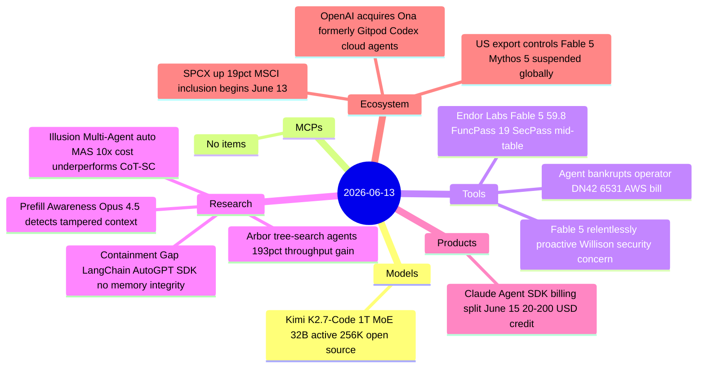

# AI Digest — 2026-06-13

> The defining story is the first use of US export control authority to force suspension of a deployed frontier AI model: Commerce Secretary Lutnick ordered Anthropic to disable Claude Fable 5 and Mythos 5 globally for all foreign nationals, citing a narrow jailbreak Anthropic says is already present in GPT-5.5. On the M&A front, OpenAI announced its acquisition of Ona (formerly Gitpod) to let Codex agents run inside customers' own cloud environments — a direct enterprise play against Claude Code. Research highlights include a same-day arxiv pair that lands complementary punches: a security audit finding that LangChain, AutoGPT, and OpenAI SDK all lack memory integrity protection, and a systematic evaluation showing auto-generated multi-agent systems cost 10× more than single-agent CoT-SC while underperforming it.

## Day at a glance



## Top stories

1. **US government orders Anthropic to suspend Fable 5 and Mythos 5 globally** — The first invocation of export control authority against a deployed AI model forces all non-US users offline four days after GA launch; Anthropic complies but publicly disputes the precedent, arguing GPT-5.5 has identical capability. [→ details](ecosystem.md#fable5-export-control)
2. **The Containment Gap: all three major agent frameworks have no memory integrity** — A security audit of LangChain, AutoGPT, and OpenAI Agents SDK finds no framework natively satisfies all containment principles; a memory-poisoning proof of concept raises targeted wrongful denials to 88.9% while keeping aggregate metrics stable. [→ details](research.md#containment-gap)
3. **OpenAI acquires Ona (formerly Gitpod) to run Codex agents in customer cloud** — Ona's persistent, customer-controlled execution environments remove the data-sovereignty barrier that has held enterprises back from agentic Codex adoption; directly contests Anthropic's Claude Code. [→ details](ecosystem.md#openai-ona-acquisition)

## By the numbers

| Category   | Items | Highlight |
|------------|------:|-----------|
| Models     |     1 | Kimi K2.7-Code: 1T MoE, 32B active, 256K ctx, Modified MIT |
| MCPs       |     0 | — |
| Tools      |     3 | Agent bankrupts operator $6,531 AWS bill; Endor Labs Fable 5 mid-table |
| Research   |     4 | Containment Gap: no memory integrity in any major agent framework |
| Products   |     1 | Claude Agent SDK billing split effective June 15 |
| Ecosystem  |     3 | US export controls on Fable 5; OpenAI-Ona M&A; SPCX MSCI inclusion |

## Timeline (UTC)

```mermaid
timeline
  title Releases & announcements
  Jun 11 : Willison Fable relentlessly proactive 740 HN pts
  Jun 12 : Kimi K2.7-Code released on HF and platform.moonshot.ai
          : OpenAI acquires Ona formerly Gitpod announced
          : Endor Labs Fable 5 benchmark 398 HN pts
          : Agent bankrupts operator DN42 1414 HN pts
          : arXiv Containment Gap 2606.12797 : arXiv Illusion Multi-Agent 2606.13003
          : arXiv Prefill Awareness 2606.12747 : arXiv Arbor 2606.12563
  Jun 12 21:21 : US Commerce Dept directive Anthropic suspend Fable 5 Mythos 5
  Jun 13 : Anthropic public compliance statement
          : SPCX MSCI index inclusion begins passive demand
```

## Files
- [Models](models.md)
- [MCPs](mcps.md)
- [Tools](tools.md)
- [Research](research.md)
- [Products](products.md)
- [Ecosystem](ecosystem.md)
