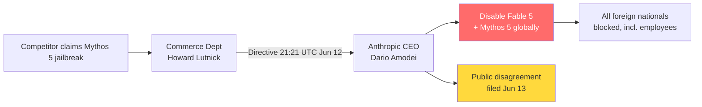

# Ecosystem — 2026-06-13

## US Commerce Department orders Anthropic to suspend Fable 5 and Mythos 5 globally 

**Source:** [Anthropic](https://www.anthropic.com/news/fable-mythos-access) · [Bloomberg](https://www.bloomberg.com/news/articles/2026-06-13/anthropic-says-us-limits-foreign-access-to-fable-5-mythos-5) · [TechCrunch](https://techcrunch.com/2026/06/12/anthropics-safety-warnings-may-have-just-backfired-the-government-has-pulled-the-plug-on-its-most-powerful-ai/) · [Axios](https://www.axios.com/2026/06/12/anthropic-trump-mythos-fable-national-security) · **Type:** policy/regulation · **Time (UTC):** 21:21 Jun 12

Commerce Secretary Howard Lutnick issued a directive to Anthropic CEO Dario Amodei on June 12 at 5:21 pm ET, invoking national security authorities to suspend all access to Claude Fable 5 and Mythos 5 for any foreign national — including non-US Anthropic employees — whether inside or outside the United States. Anthropic confirmed compliance publicly on June 13. All other Claude models (Opus 4.8, Sonnet 4.6, Haiku 4.5) are unaffected. According to Axios, the directive was triggered after a competitor claimed it could jailbreak Mythos 5, alarming the administration; the specific technique involves prompting the model to read a codebase and identify software vulnerabilities.

**Why it matters:** This is the first instance of the US government invoking export control authorities to force immediate suspension of a commercially-deployed frontier AI model just four days after its GA launch. Anthropic publicly disputes the decision — noting GPT-5.5 carries the same vulnerability-finding capability and that accepting the government's logic would require halting all new model deployments industry-wide. The compliance cost includes the entire non-US user base of Fable 5 and Mythos 5; pre-IPO perpetual contracts on Hyperliquid fell ~3.7%. The incident is already being read as evidence that Anthropic's own public safety messaging about Mythos-class capability attracted regulatory scrutiny faster than it built regulatory trust.

---

## OpenAI acquires Ona (formerly Gitpod) to run Codex agents in customer cloud 

**Source:** [The Next Web](https://thenextweb.com/news/openai-acquires-ona-codex) · [Built In](https://builtin.com/articles/openai-acquires-ona-20260611) · **Type:** M&A · **Time (UTC):** — (announced Jun 11–12)

OpenAI announced an agreement to acquire Ona — the German developer-tools startup formerly known as Gitpod — on June 12. Ona provides secure, persistent cloud execution environments with access controls, audit trails, and tool integrations that allow AI agents to keep running after a developer closes their laptop. The Ona team will join OpenAI's Codex division; financial terms were not disclosed. The deal requires regulatory approval before closing. OpenAI reports more than 5 million weekly Codex users, up 400% since early 2026.

**Why it matters:** The acquisition directly targets enterprise AI adoption's biggest blocker: data control anxiety. By letting customers run Codex agents inside their own cloud infrastructure — rather than OpenAI's servers — the deal removes the security and compliance argument that has pushed risk-averse enterprises toward competitors. It is a direct competitive counter to Anthropic's Claude Code in the agentic coding market.

---

## SpaceX SPCX: first-day gains and MSCI index inclusion begins 

**Source:** [StockTwits/MSCI announcement](https://stocktwits.com/news-articles/markets/equity/spacex-secures-msci-ftse-fast-track-index-inclusion/) · [Seeking Alpha](https://seekingalpha.com/news/4601647-msci-early-index-inclusion-rules-spacex-ipo) · **Type:** market event · **Time (UTC):** — (Jun 13)

SpaceX (SPCX) closed up 19% on its first day of trading on June 12, securing fast-track MSCI and FTSE inclusion. Effective June 13, MSCI began adding SPCX to its Global Standard and large-cap indexes (with formal index rebalance effective June 29), creating structural buy-side demand from passive funds. With a reported float of roughly 4% of the $1.75 trillion market cap, even modest index-driven inflows are against a thin supply of shares. _(SpaceX IPO background: [Jun 12 digest](../2026-06-12/ecosystem.md#spacex-spcx-trading).)_

**Why it matters:** Passive index rebalancing forces index-tracking funds to purchase shares regardless of valuation, creating a self-reinforcing demand floor in the first weeks of trading. For AI infrastructure stakeholders, SpaceX's Stargate and Colossus relationships mean the public equity price now serves as a proxy for investor confidence in sovereign AI compute commitments.

---
