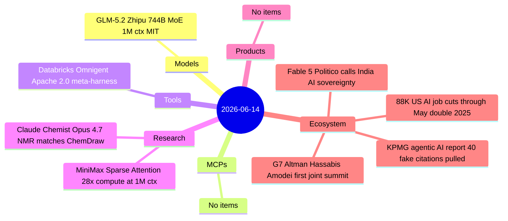
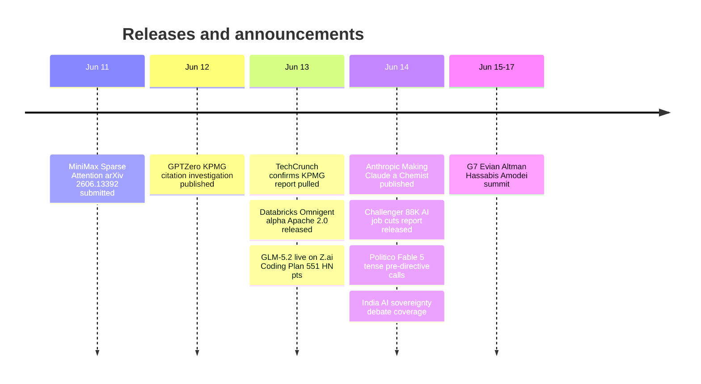

# AI Digest — 2026-06-14

> Today's defining model story is GLM-5.2 from Zhipu AI: a 744B MoE open-weight model with a genuine 1M-token context window, MIT license, and explicit coding/agent focus — arriving the week after US export controls knocked Fable 5 and Mythos 5 offline for all foreign nationals. Databricks open-sourced Omnigent, a meta-harness that orchestrates Claude Code, Codex, and Pi through a unified policy-governed interface. The Fable 5 shutdown story deepens with Politico reporting tense pre-directive calls between Trump officials and Dario Amodei, while India publicly grapples with its dependence on US-governed AI. A KPMG "agentic AI" report was pulled after GPTZero found 40 of 45 citations fabricated; Anthropic published chemistry benchmarks showing Opus 4.7 matches dedicated NMR software; and MiniMax released the technical paper behind M3's sparse attention achieving 28.4× compute reduction at 1M context.

## Day at a glance

## Top stories

1. **GLM-5.2: open-weight 1M-context frontier, MIT license** — Zhipu AI's coding-first update to GLM-5 arrives the week Fable 5 goes dark for foreign users; 744B MoE, genuine long-context retrieval, 131K max output, public weights and API next week. [→ details](models.md#glm-52)
2. **Fable 5 geopolitics deepens: tense calls and India's sovereignty crisis** — Politico reports confrontational exchanges between Trump officials and Dario Amodei before the export control directive; India now publicly reckoning with US-governed AI dependence with no domestic alternative. [→ details](ecosystem.md#fable5-followup)
3. **KPMG pulls flagship agentic AI report after GPTZero finds 40 of 45 citations fabricated** — Only 5 real citations in KPMG's October 2025 report; false case studies named UBS, NHS, Swiss Federal Railways, and Transport for London. [→ details](ecosystem.md#kpmg-retraction)

## By the numbers

| Category   | Items | Highlight |
|------------|------:|-----------|
| Models     |     1 | GLM-5.2: 744B MoE, 1M ctx, MIT, coding/agents, open weights imminent |
| MCPs       |     0 | MCP RC in validation window; no new items |
| Tools      |     1 | Omnigent: Apache 2.0 meta-harness above Claude Code, Codex, Pi |
| Research   |     2 | Opus 4.7 matches ChemDraw NMR; MSA 28.4x compute at 1M ctx |
| Products   |     0 | — |
| Ecosystem  |     4 | 88K AI job cuts; KPMG retraction; Fable 5 geopolitics; G7 preview |

## Timeline (UTC)

## Files
- [Models](models.md)
- [MCPs](mcps.md)
- [Tools](tools.md)
- [Research](research.md)
- [Products](products.md)
- [Ecosystem](ecosystem.md)
