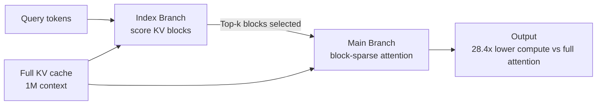

# Research — 2026-06-14

## Making Claude a Chemist: Opus 4.7 matches dedicated NMR software 

**Source:** [Anthropic Research](https://www.anthropic.com/research/making-claude-a-chemist) · **Type:** research blog · **Time (UTC):** Jun 14

Anthropic published a study evaluating Claude's performance on two NMR spectroscopy tasks: forward prediction (given a molecular structure, predict where hydrogen and carbon peaks appear in the spectrum) and inverse prediction (given experimental NMR data, determine the molecular structure). Opus 4.7 was the strongest of three Claude variants tested. On forward prediction, it achieved average errors of ±0.079 ppm for ¹H and ±1.37 ppm for ¹³C — competitive with or better than ChemDraw and MestReNova, the dedicated commercial tools chemists typically use. On inverse prediction it recovered all eight simpler target structures on every attempt from spectrum and formula alone, and succeeded on four of seven complex targets consistently. The study is collaborative with working synthetic, computational, and analytical chemists; the framing explicitly maps where Claude saves time and where expert oversight remains essential.

**Why it matters:** NMR analysis is a daily bottleneck in synthetic chemistry: manual peak assignment and structure elucidation are tedious, error-prone, and require deep familiarity with multiple molecular representations. Matching dedicated software on ¹H prediction and recovering simpler structures reliably means Claude can accelerate the most routine half of the NMR workflow today — relevant not just to pharma and materials scientists but to any engineer building lab-automation agents.

| Task | Metric | Opus 4.7 | ChemDraw / MestReNova |
|------|--------|-----------|----------------------|
| ¹H forward prediction | Mean error (ppm) | ±0.079 | Competitive |
| ¹³C forward prediction | Mean error (ppm) | ±1.37 | Competitive |
| Inverse (simple, 8 targets) | Recovery rate | 100% | — |
| Inverse (complex, 7 targets) | Recovery rate | ~57% (4/7) | — |

---

## MiniMax Sparse Attention: 28.4x compute reduction at 1M context 

**Source:** [arXiv:2606.13392](https://arxiv.org/abs/2606.13392) · [VentureBeat](https://venturebeat.com/technology/minimax-teases-upcoming-m3-model-with-new-sparse-attention-mechanism-and-15-6x-response-speed-boost) · **Type:** paper · **Time (UTC):** Jun 11 (submitted)

MiniMax published the technical paper behind the sparse attention mechanism that powers MiniMax-M3 (the model itself was covered in the [June 4 digest](../2026-06-04/models.md#minimax-m3)). The paper introduces MiniMax Sparse Attention (MSA): a blockwise approach built on Grouped Query Attention where a lightweight Index Branch scores key-value blocks and selects a Top-k subset independently per GQA group, while the Main Branch performs exact attention only over those selected blocks. At 1M context on a 109B-parameter natively multimodal model, MSA reduces per-token attention compute by 28.4× vs standard attention while matching GQA quality. Wall-clock speedups on H800 GPUs are 14.2× prefill and 7.6× decode. The authors release both a production inference kernel and the MiniMax-M3 model weights at [huggingface.co/MiniMaxAI/MiniMax-M3](https://huggingface.co/MiniMaxAI/MiniMax-M3).

**Why it matters:** Quadratic attention cost is the primary barrier to practical 1M-token deployment — serving a 1M-context request with standard attention is prohibitively expensive at production scale. A 28× compute reduction with matched quality on a production model (not just a lab prototype) is a significant engineering milestone that makes long-context inference economically viable for builders.

---
